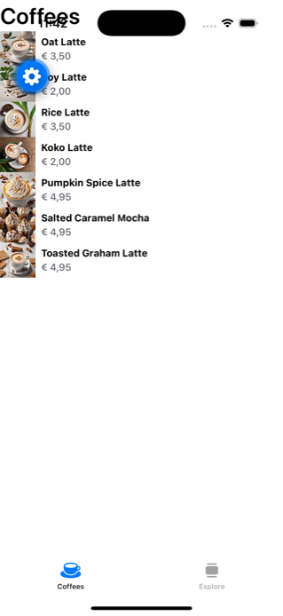
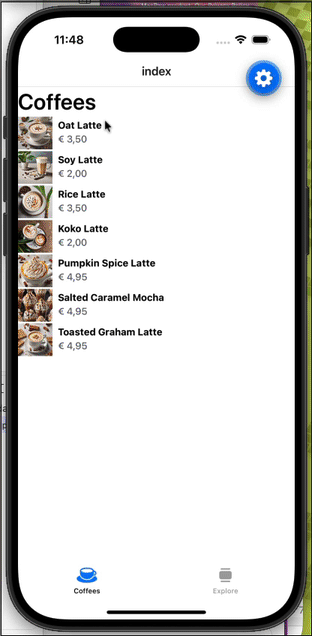
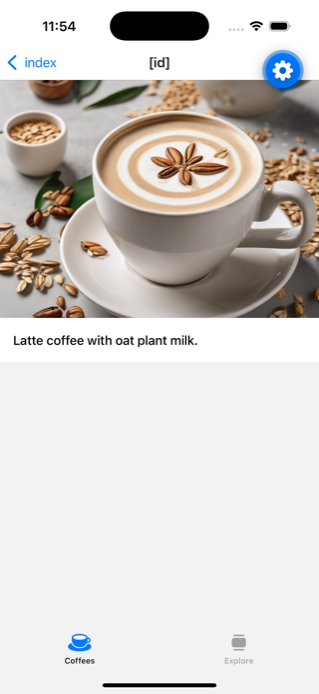
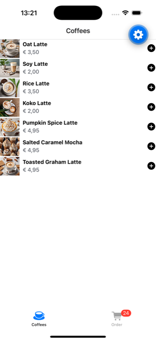
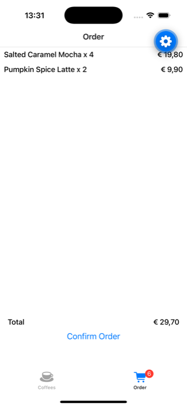
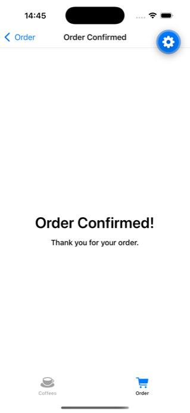

# React Native

React Native allows you to write native applications for Android and iOS using React. Ideally, you can write your code once using JavaScript / React and create platform specific builds.

We will be using Expo as a toolset to create our React Native Applications.

See also: https://expo.dev/

> ℹ️ This chapter was written for **Expo SDK 57** (the current version in the fall of 2026). If you're reading this later and a newer SDK is out, the generated starter code might look a bit different.

## Prerequisites

- Make sure to install XCode (through App store)

  > ℹ️ **Xcode 27**: the iOS Simulator is now launched through the **Device Hub** in Xcode. Open Xcode once after installing, go to the Device Hub, make sure an iOS simulator runtime is installed and start a simulator from there. Once a simulator is running, Expo's "run on iOS simulator" option will pick it up.

- Have a working [homebrew](https://brew.sh/) installation on your system. Not sure if you've got Homebrew on your system? Open a Terminal and type:

  ```bash
  brew --version
  ```

  If you get command not found, install Homebrew using the instructions on their website.

- You also should have a working nodejs version. In Devine, we've been managing our nodejs installations using [nvm](https://github.com/nvm-sh/nvm)

- Install [Watchman](https://facebook.github.io/watchman/docs/install#buildinstall) using homebrew (explained on the Watchman website).

## Getting Started

We'll build react native apps as managed expo apps instead of bare react native apps. This provides us with an improved developer experience and is sufficient for our applications.

**Go through the [Getting Started Tutorial](https://docs.expo.dev/tutorial/introduction/) on the Expo website to explore the basics of Expo and create your first app.**

## Expo Router

The next chunk of content will be implementing a multi-page app using [Expo Router](https://docs.expo.dev/router/introduction/) - a file-based router for React Native: the files and folders you create in the app directory automatically become screens and navigators in your app. It used to be a wrapper around [React Navigation](https://reactnavigation.org/), but since SDK 56 it ships with its own navigation implementation.

**Take some time to read through [the documentation pages](https://docs.expo.dev/router/introduction/) before starting on our first exercise: "The Plant Based Barista"**

## Plant Based Barista App

We'll be building a multi-page app that allows you to order a plant based coffee at a fictional coffee bar.

For this exercise, there is a **video series** available on our learning platform. I highly recommend you **watch those videos first**, so you get a general idea of what we're building.

Create a new project based upon the default template from Expo:

```bash
npx create-expo-app@latest --template default@sdk-57
```

It'll ask you to give your app a name, choose "plant-based-barista".

Give it some time to install the dependencies, and once it is done **cd into the project folder** and run npm start:

```bash
cd plant-based-barista
npm start
```

You'll be offered a menu with some options to run the app in dev mode on web, iOS or android. Choose the option to run it in the iOS simulator.

Explore the generated code. All application code lives in a `src` folder. You'll see that there are two tabs created.

```
├── src
│   ├── app
│   │   ├── _layout.tsx
│   │   ├── explore.tsx
│   │   ├── index.tsx
│   ├── components
│   │   ├── app-tabs.tsx
│   │   ├── app-tabs.web.tsx
│   │   ├── themed-text.tsx
│   │   ├── themed-view.tsx
│   │   ├── ...
│   ├── constants
│   ├── hooks
```

A couple of things to note:

- The screens of our app are the files in the `src/app` folder: `index.tsx` and `explore.tsx`.
- The root layout `src/app/_layout.tsx` wraps our app in a tab navigator, which is defined in `src/components/app-tabs.tsx`. It uses the [NativeTabs](https://docs.expo.dev/router/advanced/native-tabs/) component, which renders the platform's native tab bar.
- There's a second implementation of that tabs component: `app-tabs.web.tsx`. Files with a `.web.tsx` extension are automatically used instead of the regular file when running the app in a browser. The native tab bar obviously doesn't exist on the web, so the web version builds its own tab bar in JavaScript.

Make sure to read through the documentation to get a grasp of how this file structure works:

- https://docs.expo.dev/router/basics/core-concepts/
- https://docs.expo.dev/router/basics/layout/

### Cleaning up the starter code

The explore.tsx and index.tsx files contain a lot of demo code, let's get rid of that and keep them a bare minimum:

```tsx
import { ThemedText } from '@/components/themed-text';
import { ThemedView } from '@/components/themed-view';

export default function HomeScreen() {
  return (
    <ThemedView>
      <ThemedText type="title">Coffees</ThemedText>
    </ThemedView>
  );
}
```

> When running the project in the iOS simulator, you'll notice our content is appearing behind the status bar. We will ignore this for now, as this will be fixed automatically when we start wrapping our views in a navigation stack.

### Tab icon and label

Rename the `explore.tsx` file to `order.tsx`. You'll notice the second tab disappears and you will get a warning:

> No route named "explore" exists in nested children

You'll need to fix this by updating the name of the trigger in the `src/components/app-tabs.tsx` file:

```diff
-  <NativeTabs.Trigger name="explore">
+  <NativeTabs.Trigger name="order">
    <NativeTabs.Trigger.Label>Explore</NativeTabs.Trigger.Label>
    <NativeTabs.Trigger.Icon
      src={require('@/assets/images/tabIcons/explore.png')}
      renderingMode="template"
    />
  </NativeTabs.Trigger>
```

Our two tabs need a nice icon and a label. The starter template uses png images as tab icons, but the `<NativeTabs.Trigger.Icon>` component can also render icons from the platform's built-in icon libraries: [SF Symbols](https://developer.apple.com/sf-symbols/) on iOS (the `sf` prop) and [Material Symbols](https://fonts.google.com/icons) on Android (the `md` prop). Find a fitting icon for our coffees list and our order tab in those libraries.

Change the `Label` components of the two tabs as well into "Coffees" and "Order".

```diff
  <NativeTabs.Trigger name="index">
-    <NativeTabs.Trigger.Label>Home</NativeTabs.Trigger.Label>
-    <NativeTabs.Trigger.Icon
-      src={require('@/assets/images/tabIcons/home.png')}
-      renderingMode="template"
-    />
+    <NativeTabs.Trigger.Label>Coffees</NativeTabs.Trigger.Label>
+    <NativeTabs.Trigger.Icon sf="cup.and.saucer.fill" md="local_cafe" />
  </NativeTabs.Trigger>
```

Don't forget about the web version of the tab bar: update the two `TabTrigger` components in `src/components/app-tabs.web.tsx` as well, so the labels match and the order tab links to `/order`:

```diff
-  <TabTrigger name="home" href="/" asChild>
-    <TabButton>Home</TabButton>
-  </TabTrigger>
-  <TabTrigger name="explore" href="/explore" asChild>
-    <TabButton>Explore</TabButton>
-  </TabTrigger>
+  <TabTrigger name="coffees" href="/" asChild>
+    <TabButton>Coffees</TabButton>
+  </TabTrigger>
+  <TabTrigger name="order" href="/order" asChild>
+    <TabButton>Order</TabButton>
+  </TabTrigger>
```

## Display a list of coffees

We'll be using the [FlashList](https://docs.expo.dev/versions/latest/sdk/flash-list/) component to display a list of coffees on our first tab.

This is a highly optimized component which is able to display a ton of data in a fast scrolling list. 

Add this component to your project using the command below:

```bash
npx expo install @shopify/flash-list
```

You can find the full documentation of the component at: https://shopify.github.io/flash-list/. Find the basic usage of that component in those docs, and try to implement that basic usage in your app (`src/app/index.tsx`).

In order for the component to have a "size", you'll want to modify the styling of the root view of the component:

```tsx
return (
  <ThemedView style={{
    flex: 1,
  }}>
```

### Load the data

You can find the data and images for the coffees [in this zip file](projects/data.zip). Download it and unzip it in the `src` folder of your project (❗️ not the app subfolder):

```
├── src
│   ├── app
│   │   ├── _layout.tsx
│   │   ├── index.tsx
│   │   ├── order.tsx
│   ├── components
│   ├── data
│   │   ├── coffees
│   │   │   ├── 1-oat-milk-latte.jpg
│   │   │   ├── ...
│   │   ├── coffees.ts
```

We're using Typescript in our project, which helps us to define the shape of our data. You can find the data in the `src/data/coffees.ts` file. It's an array of objects, each object representing a coffee.

It contains an extra type definition, giving a bit more details about the properties and types of "Coffee" objects:

```ts
export type Coffee = {
  id: number;
  name: string;
  plantbased: boolean;
  description: string;
  price: number;
  image: any;
}
```

That very same file also exports an array of coffees:

```ts
const coffees:Coffee[] = [
  {
    "id":1,
    "name":"Oat Latte",
    "plantbased":true,
    "description":"Latte coffee with oat plant milk.",
    "price":3.5,
    "image": require('./coffees/1-oat-milk-latte.jpg')
  },
  ...
]
export { coffees }
```

**import this coffees array and Coffee type in your `src/app/index.tsx` file and use it to display the list of coffees in the FlashList component.**

```ts
import { Coffee, coffees } from '@/data/coffees';
```

```diff
const MyList = () => {
  return (
    <FlashList
-     data={DATA}
-     renderItem={({ item }) => <ThemedText>{item.title}</ThemedText>}
+     data={coffees}
+     renderItem={({ item }) => <ThemedText>{item.name}</ThemedText>}
    />
  );
};
```

### Display the image, name and price

We want to show more than just a coffee name, but also a thumbnail and price of the coffee.

We'll use the [expo-image](https://docs.expo.dev/versions/latest/sdk/image/) component for this - it's already part of the starter template. Import the Image component in your `src/app/index.tsx` file:

```ts
import { Image } from 'expo-image';
```

Adjust the renderItem method, so it shows the Image and the label next to each other:


```diff
<FlashList
  data={coffees}
-  renderItem={({ item }) => <ThemedText>{item.name}</ThemedText>}
+  renderItem={({ item }) => <ThemedView>
+    <Image source={item.image} style={{ width: 50, height: 50 }} />
+    <ThemedText>{item.name}</ThemedText>
+  </ThemedView>}
/>
```

Once you've got that image working, adjust the renderItem method so it shows the price as well. Use extra `<ThemedView>` components (which are basically react-native flexbox divs) to style the layout of the image, name and price. Take a look at the props of the `<ThemedText>` component: `type="smallBold"` works well for the name, and `themeColor="textSecondary"` gives the price a more subtle color.



## Navigate to detail

Whenever we tab on one of the coffees, we want to navigate to a detail page. In order to do so, we will nest a StackNavigator inside of our TabNavigator.

1. Within the `src/app` folder, add a folder called `(index)`.
2. Inside that folder, create a file called `_layout.tsx`.
3. In that file, import and export the Stack component from expo-router:

  ```ts
  import { Stack } from 'expo-router';
  export default Stack;
  ```

4. Move the `src/app/index.tsx` file into the `src/app/(index)` folder.

```
├── src
│   ├── app
│   │   ├── (index)
│   │   │   ├── _layout.tsx
│   │   │   ├── index.tsx
│   │   ├── _layout.tsx
│   │   ├── order.tsx
...
```

You'll notice you're getting a familiar warning message:

> No route named "index" exists in nested children

Make sure to update the name of the trigger from `index` to `(index)` in the `src/components/app-tabs.tsx` file. (The web version in `app-tabs.web.tsx` links by href instead of by route name, so it can stay as it is.)

You'll also see that our content no longer sits behind the status bar: the Stack navigator adds a header to our screen.

### Link to the detail screen

Within the (index) group, create a new file `[id].tsx`. This will be our detail screen.

Create a basic view with some text in it:

```tsx
import { ThemedText } from '@/components/themed-text';
import { ThemedView } from '@/components/themed-view';

export default function DetailScreen() {
  return (
    <ThemedView>
      <ThemedText type="title">Detail</ThemedText>
    </ThemedView>
  );
}
```

In your `src/app/(index)/index.tsx` file, import the Link component from expo-router:

```ts
import { Link } from 'expo-router';
```

Wrap the FlashList items in a Link component, and link to the detail screen:

```diff
renderItem={({ item }) => (
+ <Link href={`/(index)/${item.id}`}>
  <ThemedView style={{
    flexDirection: 'row',
    gap: 10,
  }}>
    <Image source={item.image} style={{ width: 50, height: 50 }} />
    <ThemedView>
      <ThemedText type='smallBold'>{item.name}</ThemedText>
      <ThemedText themeColor='textSecondary'>{item.price.toLocaleString("be-NL", { style: "currency", currency: "EUR" })}</ThemedText>
    </ThemedView>
  </ThemedView>
+</Link>)}
```

Test the app (you might need to do a full restart of your dev server). Tapping an item should move to the detail screen:



## Display the coffee details

The filename of our detail view has a special name: `[id].tsx`. This means that the id of the coffee will be available as a parameter in the `useLocalSearchParams` hook of expo-router.

```tsx
import { ThemedText } from '@/components/themed-text';
import { ThemedView } from '@/components/themed-view';
import { useLocalSearchParams } from 'expo-router';

export default function DetailScreen() {
  const { id } = useLocalSearchParams();

  return (
    <ThemedView>
      <ThemedText type="title">Detail of {id}</ThemedText>
    </ThemedView>
  );
}
```

You should see the id of the coffee in the detail screen now.

Using that id, we can get the relevant coffee from our coffees array:

```tsx
const { id } = useLocalSearchParams();
const coffee = coffees.find((coffee) => coffee.id === id);

return (
  <ThemedView>
    <ThemedText>Detail of {coffee?.name}</ThemedText>
  </ThemedView>
)
```

Trying this code, you'll see that it doesn't work. Thanks to Typescript, some of the code with an issue is being highlighted, with an error message:

> This comparison appears to be unintentional because the types 'number' and 'string | string[]' have no overlap.

This is because the id parameter is a string, and the id of the coffee is a number. We can fix this by converting the id parameter to a number:

```tsx
const { id } = useLocalSearchParams();
const coffee = coffees.find((coffee) => coffee.id === Number(id));
```

Once you've got this working, adjust the code so that it shows the image and description of the coffee.



## Header Titles

Our detail header currently shows the text "[id]". We want to show the name of the coffee in the header.

We can do so, by adding a `<Stack.Screen />` component in our view.

```diff
import { ThemedText } from '@/components/themed-text';
import { ThemedView } from '@/components/themed-view';
import { coffees } from '@/data/coffees';
- import { useLocalSearchParams } from 'expo-router';
+ import { Stack, useLocalSearchParams } from 'expo-router';
import { Image } from 'expo-image';

export default function DetailScreen() {

  const { id } = useLocalSearchParams();
  const coffee = coffees.find((coffee) => coffee.id === Number(id));

  return (
    <ThemedView>
+      <Stack.Screen
+        options={{ title: coffee?.name }}
+      />
      <Image source={coffee?.image} style={{ width: '100%', height: 300 }} />
      <ThemedView style={{ padding: 16 }}>
        <ThemedText>{coffee?.description}</ThemedText>
      </ThemedView>
    </ThemedView>
  );
}
```

The detail screen should now show the coffee title.

Also adjust the overview, so that it shows the title "Coffees" in the header.

## Central data store using Zustand

On our coffees list screen, we want to add coffees to our order (which is further handled on the order screen). We'll manage this shared data in a [Zustand store](https://github.com/pmndrs/zustand). Make sure to read through the documentation of Zustand to get a grasp of how it works.

**Add Zustand to your project using the command below:**

```bash
npm install zustand
```

Create a new file `src/hooks/use-order-store.ts` (the hooks folder already exists in the src folder of your project) and add the following code, defining our Order type:

```ts
import { Coffee } from '@/data/coffees'
import { create } from 'zustand'

type Order = {
  coffee: Coffee,
  amount: number,
}
```

We need to describe the interface of our store as well. We will manage an array of Orders, and have two methods to add a coffee to the order and to reset the order:

```ts
interface OrderState {
  orders: Order[],
  orderCoffee: (coffee: Coffee) => void,
  resetOrders: () => void,
}
```

This interface is just a description of what the store will do, but doesn't contain any logic. It's a contract where our implementation will adhere to.

Create a store using zustand's `create` method:

```ts
export const useOrderStore = create<OrderState>()((set) => ({
  orders: [],
  orderCoffee: (coffee) => set((state) => {
    // todo
  }),
  resetOrders: () => set((state) => {
    // todo
  }),
}))
```

We're (obviously) still missing the implementation details of our orderCoffee and resetOrders methods.

These methods will update the data of our store, and return the result of a built-in zustand method called `set`. This method receives the existing state of our store, and expects us to return the new state of our store.

In case of our orderCoffee and resetOrders methods, they should return an object containing the updated `orders` array.

### resetOrders

This is an easy one: we just want to return an empty array:

```ts
resetOrders: () => set((state) => ({
  orders: [],
})),
```

### orderCoffee

The orderCoffee function receives a `Coffee` instance, and needs to update the orders array. There are two scenarios:

1. The coffee is not yet in the orders array, in which case we need to add a new order to the array.
2. The coffee is already in the orders array, in which case we need to update the amount of that order.

```ts
const coffeeIndex = state.orders.findIndex((order) => order.coffee.id === coffee.id);
const coffeeHasAlreadyBeenOrdered = coffeeIndex !== -1;
if (coffeeHasAlreadyBeenOrdered) {
  // todo: return an updated array
}
// else: return orders array with an added order
```

In case of the else statement, we need to return an array with an added order. We can do this using the spread operator:

```ts
return {
  orders: [
    ...state.orders,
    {
      coffee,
      amount: 1,
    }
  ]
}
```

In case the coffee is already in the array, we will map over the orders and update the one order with the matching id:

```ts
if (coffeeHasAlreadyBeenOrdered) {
  return {
    orders: state.orders.map((order, index) => {
      if (index === coffeeIndex) {
        return {
          ...order,
          amount: order.amount + 1,
        }
      }
      return order;
    })
  };
}
```

## Add coffee orders to the store

Inside of the list, we want to add a button to add a coffee to the cart.

Import the useOrderStore hook in your `src/app/(index)/index.tsx` file:

```ts
import { useOrderStore } from '@/hooks/use-order-store';
```

Inside the component's render function get the `orderCoffee` method from the store's state:

```ts
const orderCoffee = useOrderStore(state => state.orderCoffee);
const theme = useTheme();
```

For the icon on the button, we'll use the [SymbolView](https://docs.expo.dev/versions/latest/sdk/symbols/) component from expo-symbols (it's already part of the starter template). Just like the tab icons, it renders SF Symbols on iOS and Material Symbols on Android. Add the necessary imports:

```ts
import { SymbolView } from 'expo-symbols';
import { useTheme } from '@/hooks/use-theme';
```

Update the renderItem logic, so that it contains an add button to the right (the `useTheme()` hook gives you the colors of the current light / dark theme, so the icon is visible in both):

```tsx
<Pressable
  onPress={() => orderCoffee(item)}
  style={({pressed}) => [
    {
      opacity: pressed ? 0.5 : 1.0,
    },
  ]}>
  <SymbolView
    name={{ ios: 'plus.circle.fill', android: 'add_circle', web: 'add_circle' }}
    tintColor={theme.text}
    size={24}
  />
</Pressable>
```

Pressing the button will now execute the logic in the store and add items to the orders array.

### Display the number of items in the cart

We can show a badge on our cart tab icon, to display the amount of items in the cart. Open up `src/components/app-tabs.tsx`, and get the orders from the store using the hook:

```ts
const orders = useOrderStore(state => state.orders);
const coffeeCount = orders.length;
```

Add a Badge to the order trigger:

```diff
<NativeTabs.Trigger name="order">
  <NativeTabs.Trigger.Label>Order</NativeTabs.Trigger.Label>
  <NativeTabs.Trigger.Icon sf="cart.fill" md="shopping_cart" />
+  {coffeeCount > 0 && (
+    <NativeTabs.Trigger.Badge>{`${coffeeCount}`}</NativeTabs.Trigger.Badge>
+  )}
</NativeTabs.Trigger>
```

You should see a badge with a number on the tab icon now. This does not take into account the amount of items in the order.

**Adjust the code calculating the coffeeCount so it takes the amount of items into account.**

The web tab bar doesn't have a badge component, but you can show the count in the label. In `src/components/app-tabs.web.tsx`, get the coffeeCount from the store in the same way, and use it in the order TabButton:

```diff
<TabTrigger name="order" href="/order" asChild>
-  <TabButton>Order</TabButton>
+  <TabButton>{coffeeCount > 0 ? `Order (${coffeeCount})` : 'Order'}</TabButton>
</TabTrigger>
```



## Order Screen

The Order tab will also consist of two screens in a stack: the order overview and an order confirmation screen.

1. Create a subfolder `src/app/order` and create a file `_layout.tsx` in that folder. This layout is a copy from the `(index)` layout, which is a re-export of the Stack component from expo-router.
2. Move the `src/app/order.tsx` file into the `src/app/order` folder. Rename that file to `index.tsx`.

```
├── src
│   ├── app
│   │   ├── (index)
│   │   │   ├── _layout.tsx
│   │   │   ├── [id].tsx
│   │   │   ├── index.tsx
│   │   ├── order
│   │   │   ├── _layout.tsx
│   │   │   ├── index.tsx
│   │   ├── _layout.tsx
...
```

Use the useOrderStore hook to retrieve the orders from the store, and display them in a FlashList component. Add the necessary calculations to calculate the line item totals and total price, and display those as well. Make sure there is a Button (`import { Button } from "react-native";` ) at the bottom of that screen to confirm the order.

You'll notice that the total and the button disappear behind the tab bar: the native tab bar floats on top of our content. The starter template has a `BottomTabInset` constant for this, which we can combine with the safe area insets to add the necessary padding below our content:

```tsx
import { useSafeAreaInsets } from 'react-native-safe-area-context';
import { BottomTabInset } from '@/constants/theme';

// inside the component:
const insets = useSafeAreaInsets();

// on the view wrapping the total and the button:
<ThemedView style={{ paddingBottom: insets.bottom + BottomTabInset }}>
```



## Order confirmed screen

When the user confirms the order, we want to show a confirmation screen. This screen will be a simple screen with a text and a button to go back to the coffees list.

Create a file `src/app/order/confirmation.tsx` which displays a simple thank you message.



When clicking the "Confirm Order" button on the order screen, we need to clear the order list from the store and navigate to the confirmation screen.

Make sure to import the router from expo-router at the top of that file:

```ts
import { Stack, router } from "expo-router";
```

Get the resetOrders method from the store:

```ts
const resetOrders = useOrderStore(state => state.resetOrders);
```

And link the necessary logic to that confirmation button:

```tsx
<Button title="Confirm Order" onPress={() => {
  resetOrders();
  router.push('/order/confirmation');
}} />
```

## Where to go from here

We've barely scratched the surface of what you can do using React Native.

- Provide App icons and a splash screen
- Try running the app on your physical device
- Did it actually happen, if it's not on social media? Add an image capture screen with share functionality.
- Explore the [Expo UI](https://docs.expo.dev/versions/latest/sdk/ui/) components that ship with the starter template
- Browse the [React Native Directory](https://reactnative.directory/) - a searchable catalog of community libraries for pretty much anything you'd want to add to your app
- Add some smooth animations with [react-native-reanimated](https://docs.swmansion.com/react-native-reanimated/) - it's already part of the starter template
