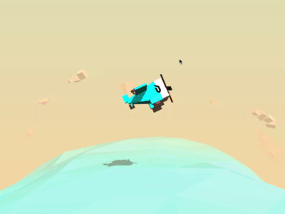
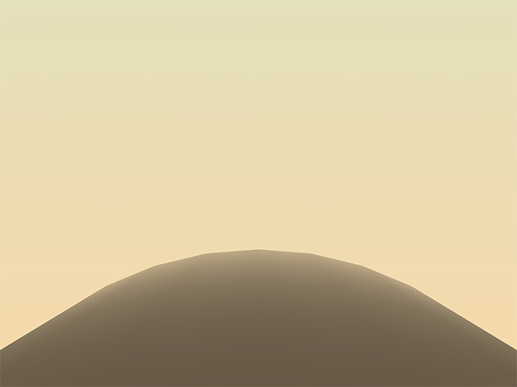
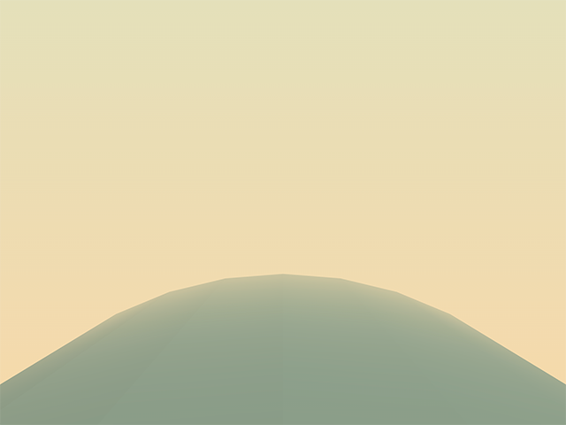
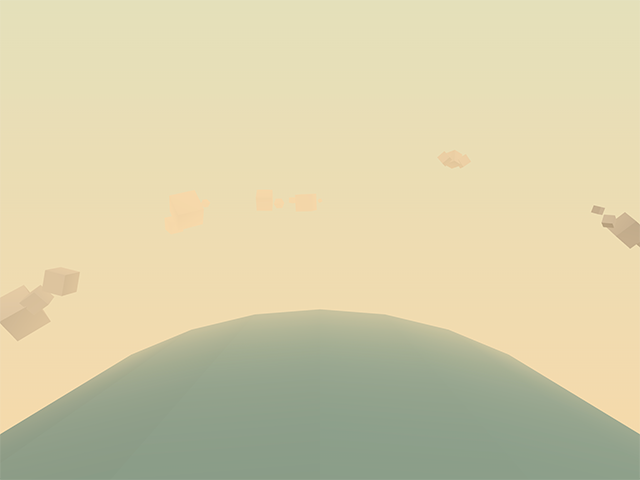
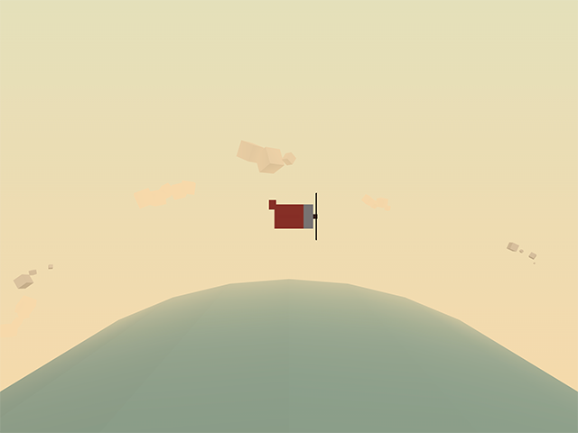
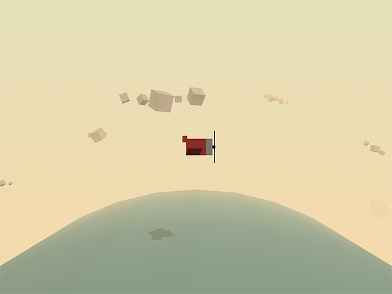
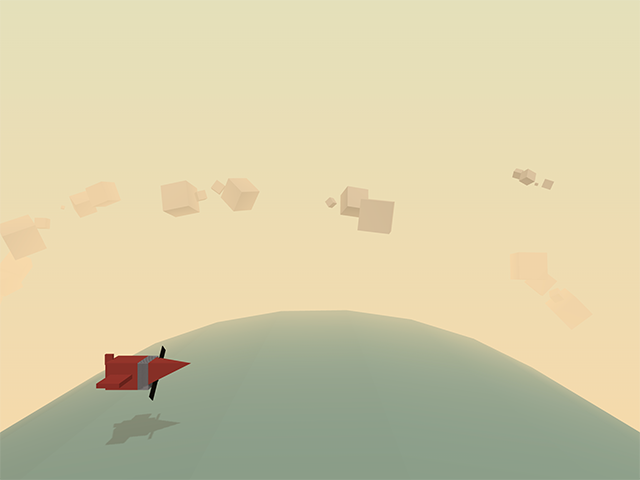
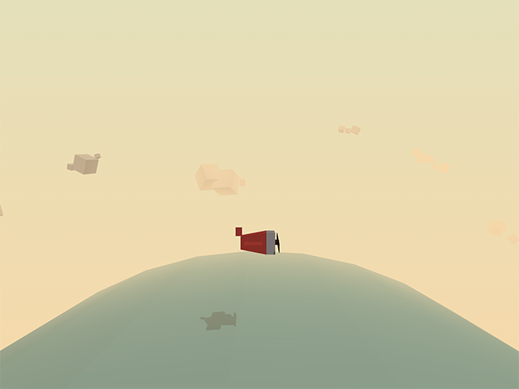
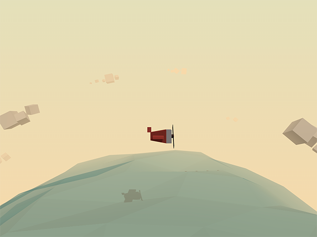
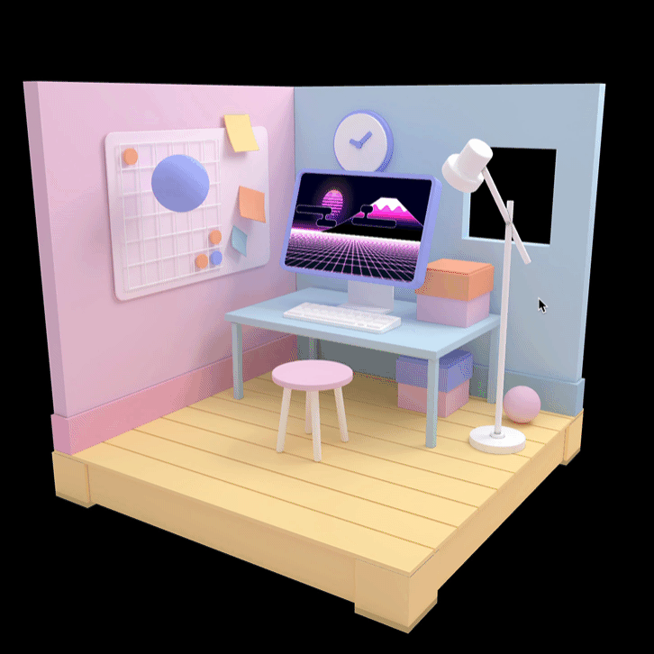

# ThreeJS

Doing 2D WebGPU might have seemed a lot of work already, and things get a bit more complicated when we start adding the 3rd dimension. This is why we'll use [Three.js](https://threejs.org/) to abstract some of the math and shader stuff.

Three.js itself has some great [documentation](https://threejs.org/docs/index.html#manual/en/introduction/Creating-a-scene) and [an extensive list of examples](https://threejs.org/examples/).

To learn how to work with Three.js, we are going to go with the lesson series at https://threejs.org/manual/#en/fundamentals. We'll go through some of the pages there, before creating an interactive 3D experience.

## Hello Three.js

To be able to run of the Thee.js code, you'll need to link the Three.js library. We'll just use the CDN for now. And, as you're just experimenting and learning right now, you don't really need to go through the trouble of settings up a bundler / transpiler.

To tell our browser where to find the threejs module, add an `<script type="importmap">` tag to your html:

```html
<script type="importmap">{
  "imports": {
    "three": "https://unpkg.com/three@0.156.0/build/three.module.js",
    "three/addons/": "https://unpkg.com/three@0.156.0/examples/jsm/"
  }
}</script>
```

You'll write your code in a second script tag, with type module. This way you can use the import syntax to import the Three.js library:

```html
<script type="module">
  import * as THREE from 'three';
</script>
```

You'll start by going through the page at https://threejs.org/manual/#en/fundamentals where you'll build a basic Three.js scene, familiarizing yourself with some basic Three.js concepts.

Work your way through the following lessons:

- https://threejs.org/manual/#en/responsive
- https://threejs.org/manual/#en/primitives
- https://threejs.org/manual/#en/scenegraph

Read up on materials at https://threejs.org/manual/#en/materials

And continue coding with:

- https://threejs.org/manual/#en/textures (up until Filtering and Mips)

After handling the basics of textures, read through the following pages, and check the live demos. No need to code these yourself, just get yourself familiar with the different types and options:

- https://threejs.org/manual/#en/lights
- https://threejs.org/manual/#en/cameras
- https://threejs.org/manual/#en/shadows

## The Aviator

We'll build a fun little interactive 3D scene, based on the tutorial at https://tympanus.net/codrops/2016/04/26/the-aviator-animating-basic-3d-scene-threejs/. Since that tutorial was written, there have been a few changes to threejs, so the guide in this course will be slightly different.



Start with a basic html file, which as a couple of style rules to make sure the canvas is fullscreen and our body has a gradient background:

```html
<!DOCTYPE html>
<html lang="en">
<head>
  <meta charset="UTF-8">
  <meta name="viewport" content="width=device-width, initial-scale=1.0">
  <meta http-equiv="X-UA-Compatible" content="ie=edge">
  <title>The Aviator</title>
  <style>
    html, body {
      margin: 0;
      height: 100%;
    }
    body {
      background: linear-gradient(#e4e0ba, #f7d9aa);
    }
    #c {
      width: 100%;
      height: 100%;
      display: block;
    }
  </style>
</head>
<body>
  <canvas id="c"></canvas>
  <script src="js/script.js" type="module"></script>
</body>
</html>
```

In the script.js tag we add the basic boilerplate to setup a renderer, scene and camera, with resize logic as well. Make sure to either add the import maps for three in your html file, or use a bundler to import the threejs library.

```javascript
import * as THREE from 'three';

const canvas = document.querySelector('#c');
const renderer = new THREE.WebGLRenderer({
  canvas,
  alpha: true,
  antialias: true
})

const fov = 60;
const aspect = 2;
const near = 1;
const far = 10000;
const camera = new THREE.PerspectiveCamera(fov, aspect, near, far);
camera.position.y = 100;
camera.position.z = 200;

const scene = new THREE.Scene();
scene.fog = new THREE.Fog(0xf7d9aa, 100, 950);

const init = () => {
  requestAnimationFrame(render);
};

const render = () => {
  if (resizeRendererToDisplaySize(renderer)) {
    const canvas = renderer.domElement;
    camera.aspect = canvas.clientWidth / canvas.clientHeight;
    camera.updateProjectionMatrix();
  }

  renderer.render(scene, camera);
  requestAnimationFrame(render);
};

const resizeRendererToDisplaySize = (renderer) => {
  const canvas = renderer.domElement;
  const pixelRatio = window.devicePixelRatio;
  const width  = canvas.clientWidth  * pixelRatio | 0;
  const height = canvas.clientHeight * pixelRatio | 0;
  const needResize = canvas.width !== width || canvas.height !== height;
  if (needResize) {
    renderer.setSize(width, height, false);
  }
  return needResize;
}

init();
```

### Defining some colors

Create a file `constants/colors.js` which exports a colors const:

```javascript
export const Colors = {
  red:0xf25346,
  white:0xd8d0d1,
  brown:0x59332e,
  pink:0xF5986E,
  brownDark:0x23190f,
  blue:0x68c3c0,
};
```

### Creating your first mesh

Let's create a mesh for the sea. Add a file `objects/sea.js` with the following code:

```javascript
import * as THREE from 'three';
import { Colors } from '../constants/colors';

export const createSea = () => {
  // create the geometry (shape) of the cylinder;
  // the parameters are: 
  // radius top, radius bottom, height, number of segments on the radius, number of segments vertically
  const geom = new THREE.CylinderGeometry(600,600,800,40,10);
  
  // rotate the geometry on the x axis
  geom.applyMatrix4(new THREE.Matrix4().makeRotationX(-Math.PI/2));
  
  // create the material 
  const mat = new THREE.MeshPhongMaterial({
    color:Colors.blue,
    transparent:true,
    opacity:.6,
    flatShading: true,
  });

  // To create an object in Three.js, we have to create a mesh 
  // which is a combination of a geometry and some material
  const mesh = new THREE.Mesh(geom, mat);

  // Allow the sea to receive shadows
  mesh.receiveShadow = true;

  return {
    mesh
  }
};
```

This method returns an object, with a property "mesh", which points to the mesh that was created in that method.

Import the createSea method in your main script, and add the mesh to the scene:

```javascript
import { createSea } from './objects/sea';

// here be some code

const init = () => {

  // adding the sea mesh
  const { mesh: seaMesh } = createSea();
  seaMesh.position.y = -600;
  scene.add(seaMesh);
  // end adding the sea mesh

  requestAnimationFrame(render);
};

// here be some code
```

You should see part of a dark cylinder on your screen:



### Adding some lights

Let's add some lights to the scene. Add a file `objects/lights.js` with the following code:

```javascript
import * as THREE from 'three';

export const createLights = () => {
  // A hemisphere light is a gradient colored light; 
  // the first parameter is the sky color, the second parameter is the ground color, 
  // the third parameter is the intensity of the light
  const hemisphereLight = new THREE.HemisphereLight(0xaaaaaa,0x000000, .9)
  
  // A directional light shines from a specific direction. 
  // It acts like the sun, that means that all the rays produced are parallel. 
  const shadowLight = new THREE.DirectionalLight(0xffffff, .9);

  // Set the direction of the light  
  shadowLight.position.set(150, 350, 350);
  
  // Allow shadow casting 
  shadowLight.castShadow = true;

  // define the visible area of the projected shadow
  shadowLight.shadow.camera.left = -400;
  shadowLight.shadow.camera.right = 400;
  shadowLight.shadow.camera.top = 400;
  shadowLight.shadow.camera.bottom = -400;
  shadowLight.shadow.camera.near = 1;
  shadowLight.shadow.camera.far = 1000;

  // define the resolution of the shadow; the higher the better, 
  // but also the more expensive and less performant
  shadowLight.shadow.mapSize.width = 2048;
  shadowLight.shadow.mapSize.height = 2048;

  return {
    hemisphereLight,
    shadowLight
  }
}
```

Write the necessary code in your main script, to call this function, adding the lights to your scene:

```javascript
const { hemisphereLight, shadowLight } = createLights();
scene.add(hemisphereLight);
scene.add(shadowLight);
```

You should see the following result:



### Adding the sky

Let's create a sky with some clouds. The clouds will be a combination of a couple of meshes.

Create a file `objects/cloud.js` with the following code:

```javascript
import * as THREE from 'three';
import { Colors } from '../constants/colors';

export const createCloud = () => {
  // Create an empty container that will hold the different parts of the cloud
  const mesh = new THREE.Object3D();
  
  // create a cube geometry;
  // this shape will be duplicated to create the cloud
  const geom = new THREE.BoxGeometry(20,20,20);
  
  // create a material; a simple white material will do the trick
  const mat = new THREE.MeshPhongMaterial({
    color:Colors.white,  
  });
  
  // duplicate the geometry a random number of times
  const nBlocs = 3+Math.floor(Math.random()*3);
  for (let i=0; i<nBlocs; i++ ){
    
    // create the mesh by cloning the geometry
    const m = new THREE.Mesh(geom, mat); 
    
    // set the position and the rotation of each cube randomly
    m.position.x = i*15;
    m.position.y = Math.random()*10;
    m.position.z = Math.random()*10;
    m.rotation.z = Math.random()*Math.PI*2;
    m.rotation.y = Math.random()*Math.PI*2;
    
    // set the size of the cube randomly
    const s = .1 + Math.random()*.9;
    m.scale.set(s,s,s);
    
    // allow each cube to cast and to receive shadows
    m.castShadow = true;
    m.receiveShadow = true;
    
    // add the cube to the container we first created
    mesh.add(m);
  }
  return {
    mesh
  }
}
```

This is the code for one single cloud. Create another file `objects/sky.js` where we'll create multiple clouds:

```javascript
import * as THREE from 'three';
import { createCloud } from "./cloud";

export const createSky = () => {
  // Create an empty container
  const mesh = new THREE.Object3D();
  
  // choose a number of clouds to be scattered in the sky
  const nClouds = 20;
  
  // To distribute the clouds consistently,
  // we need to place them according to a uniform angle
  const stepAngle = Math.PI*2 / nClouds;
  
  // create the clouds
  for(let i=0; i<nClouds; i++){
    const { mesh: cloudMesh } = createCloud();
   
    // set the rotation and the position of each cloud;
    // for that we use a bit of trigonometry
    const a = stepAngle*i; // this is the final angle of the cloud
    const h = 750 + Math.random()*200; // this is the distance between the center of the axis and the cloud itself

    // Trigonometry!!! I hope you remember what you've learned in Math :)
    // in case you don't: 
    // we are simply converting polar coordinates (angle, distance) into Cartesian coordinates (x, y)
    cloudMesh.position.y = Math.sin(a)*h;
    cloudMesh.position.x = Math.cos(a)*h;

    // rotate the cloud according to its position
    cloudMesh.rotation.z = a + Math.PI/2;

    // for a better result, we position the clouds 
    // at random depths inside of the scene
    cloudMesh.position.z = -400-Math.random()*400;
    
    // we also set a random scale for each cloud
    const s = 1+Math.random()*2;
    cloudMesh.scale.set(s,s,s);

    // do not forget to add the mesh of each cloud in the scene
    mesh.add(cloudMesh);  
  }

  return {
    mesh
  };
}
```

End with adding the sky to the scene in your main script:

```javascript
const { mesh: skyMesh } = createSky();
skyMesh.position.y = -600;
scene.add(skyMesh);
```



### Creating the airplane

Add another file called `objects/plane.js` with the following code:

```javascript
import * as THREE from 'three';
import { Colors } from '../constants/colors';

export const createPlane = () => {
  
  const mesh = new THREE.Object3D();
  
  // Create the cabin
  const geomCockpit = new THREE.BoxGeometry(60,50,50,1,1,1);
  const matCockpit = new THREE.MeshPhongMaterial({color:Colors.red, flatShading: true});
  const cockpit = new THREE.Mesh(geomCockpit, matCockpit);
  cockpit.castShadow = true;
  cockpit.receiveShadow = true;
  mesh.add(cockpit);
  
  // Create the engine
  const geomEngine = new THREE.BoxGeometry(20,50,50,1,1,1);
  const matEngine = new THREE.MeshPhongMaterial({color:Colors.white, flatShading: true});
  const engine = new THREE.Mesh(geomEngine, matEngine);
  engine.position.x = 40;
  engine.castShadow = true;
  engine.receiveShadow = true;
  mesh.add(engine);
  
  // Create the tail
  const geomTailPlane = new THREE.BoxGeometry(15,20,5,1,1,1);
  const matTailPlane = new THREE.MeshPhongMaterial({color:Colors.red, flatShading: true});
  const tailPlane = new THREE.Mesh(geomTailPlane, matTailPlane);
  tailPlane.position.set(-35,25,0);
  tailPlane.castShadow = true;
  tailPlane.receiveShadow = true;
  mesh.add(tailPlane);
  
  // Create the wing
  const geomSideWing = new THREE.BoxGeometry(40,8,150,1,1,1);
  const matSideWing = new THREE.MeshPhongMaterial({color:Colors.red, flatShading: true});
  const sideWing = new THREE.Mesh(geomSideWing, matSideWing);
  sideWing.castShadow = true;
  sideWing.receiveShadow = true;
  mesh.add(sideWing);
  
  // propeller
  const geomPropeller = new THREE.BoxGeometry(20,10,10,1,1,1);
  const matPropeller = new THREE.MeshPhongMaterial({color:Colors.brown, flatShading: true});
  const propellerMesh = new THREE.Mesh(geomPropeller, matPropeller);
  propellerMesh.castShadow = true;
  propellerMesh.receiveShadow = true;
  
  // blades
  const geomBlade = new THREE.BoxGeometry(1,100,20,1,1,1);
  const matBlade = new THREE.MeshPhongMaterial({color:Colors.brownDark, flatShading: true});
  
  const blade = new THREE.Mesh(geomBlade, matBlade);
  blade.position.set(8,0,0);
  blade.castShadow = true;
  blade.receiveShadow = true;
  propellerMesh.add(blade);
  propellerMesh.position.set(50,0,0);
  mesh.add(propellerMesh);

  return {
    mesh
  }
};
```

Add the plane to the scene in your main script:

```javascript
  const { mesh: planeMesh } = createPlane();
  planeMesh.scale.set(.25,.25,.25);
  planeMesh.position.y = 100;
  scene.add(planeMesh);
```



We're still missing something: shadows. While our meshes are set to cast and receive shadows, we haven't enabled shadows on our renderer yet.

Set the shadowMapEnabled property to true on your renderer:

```javascript
renderer.shadowMap.enabled = true;
```

And enjoy some shadows:



### Adding mouse interaction

We'll add some mouse interaction to our scene, so we can control the plane with our mouse.

First of all, at the top of your main script, define a mousePos const, where we will store the mouse coordinates:

```javascript
const mousePos = {x:0, y:0};
```

Define a handleMouseMove event handler, where you update that mousePos object:

```javascript
const handleMouseMove = (event) => {
  // here we are converting the mouse position value received 
  // to a normalized value varying between -1 and 1;
  // this is the formula for the horizontal axis:
  mousePos.x = -1 + (event.clientX / window.innerWidth)*2;

  // for the vertical axis, we need to inverse the formula 
  // because the 2D y-axis goes the opposite direction of the 3D y-axis
  mousePos.y = 1 - (event.clientY / window.innerHeight)*2;
};
```

Finally, in your init function, link this event handler to the mousemove event on the document:

```javascript
document.addEventListener('mousemove', handleMouseMove, false);
```

We now have a global mouse position, which gets updated automatically when the mouse moves.

Let's update our render loop, so that we take this mouse position into account when rendering the scene.

Create an updatePlane method and a normalize method (to easily transform the mouse position to a value which makes sense for the plane)

```javascript
const updatePlane = () => {
  // let's move the airplane between -100 and 100 on the horizontal axis, 
  // and between 25 and 175 on the vertical axis,
  // depending on the mouse position which ranges between -1 and 1 on both axes;
  // to achieve that we use a normalize function (see below)
  
  const targetX = normalize(mousePos.x, -1, 1, -100, 100);
  const targetY = normalize(mousePos.y, -1, 1, 25, 175);

  // update the airplane's position
  planeMesh.position.y = targetY;
  planeMesh.position.x = targetX;
};

const normalize = (v,vmin,vmax,tmin, tmax) => {
  const nv = Math.max(Math.min(v,vmax), vmin);
  const dv = vmax-vmin;
  const pc = (nv-vmin)/dv;
  const dt = tmax-tmin;
  const tv = tmin + (pc*dt);
  return tv;
};
```

Call the `updatePlane` method in your render loop (you'll get an error):

> Uncaught ReferenceError: planeMesh is not defined

We'll need to move the planeMesh definition into a global variable, so we can access it from the updatePlane method:

```javascript
// at the top of your main file:
let planeMesh = undefined;
```

```javascript
// when creating the plane
const { mesh: localPlaneMesh } = createPlane();
planeMesh = localPlaneMesh;
```

You should now be able to move the plane using your mouse cursor.

### Rotating the clouds and cylinder

We'll update the rotations of the clouds and cylinder in our render loop. In order to do so, we will need to store those mesh definitions in a global variable as well, just like we did with the planeMesh.

```javascript
// at the top of your main file
let seaMesh, skyMesh = undefined;
```

```javascript
// update code to store the meshes in those global variables:
const { mesh: localSeaMesh } = createSea();
seaMesh = localSeaMesh;
seaMesh.position.y = -600;
scene.add(seaMesh);
2
const { mesh: localSkyMesh } = createSky();
skyMesh = localSkyMesh;
skyMesh.position.y = -600;
scene.add(skyMesh);
```

We're now able to modify those meshes in our render loop:

```javascript
seaMesh.rotation.z += .005;
skyMesh.rotation.z += .01;
updatePlane();
```

### Animating the propeller

A plane with no rotating propellet is not a plane. Let's add some animation to the propeller. In order to access the propeller from our render loop, we'll need to return the propeller mesh from our createPlane method as well:

```javascript
return {
  mesh,
  propellerMesh
}
```

In your main script, store the propeller mesh in a global variable:

```javascript
const { mesh: localPlaneMesh, propellerMesh: localPropellerMesh } = createPlane();
planeMesh = localPlaneMesh;
propellerMesh = localPropellerMesh;
```

Finally, update your render loop, so it looks like this:

```javascript
const render = () => {
  if (resizeRendererToDisplaySize(renderer)) {
    const canvas = renderer.domElement;
    camera.aspect = canvas.clientWidth / canvas.clientHeight;
    camera.updateProjectionMatrix();
  }

  seaMesh.rotation.z += .005;
  skyMesh.rotation.z += .01;
  propellerMesh.rotation.x += 0.3;
  updatePlane();

  renderer.render(scene, camera);
  requestAnimationFrame(render);
};
```

## Aviator - Part 2

In the previous part, we've created a basic scene with a plane, clouds and a sea. In this part, we'll make the plane look cooler, and create a moving Sea. Like the initial part, this is an updated version of the original tutorial at https://tympanus.net/codrops/2016/04/26/the-aviator-animating-basic-3d-scene-threejs/.

### Fancy Plane

Duplicate the plane.js file and call it planeFancy.js. Replace the import in your main script, so it used the fancy plane instead of the simple plane.

We're going to modify the vertex positions of the cockpit. Since threejs version 125, you'll need to do this through the position attribute of the shader. This is a bit more complicated than it used to be, but it's also more performant.

Add the following code to your planeFancy.js file, right after creating the `geomCockpit`:

```javascript
const positionAttribute = geomCockpit.attributes.position;
const positionArray = positionAttribute.array;
console.log(positionArray.length / 3);
```

This code gets the position attribute and array, and logs the number of vertices (each vertex has 3 components, for x, y and z, so we divide the length by 3).

You should see the following output in your console:

> 24

This means we have 24 vertices in our cockpit, which seems like a lot for a simple box. This is because we have 6 faces, each with 4 vertices. If we want better control of the vertices, it's better to merge the vertices of the faces, so we'd have 8 vertices instead of 24.

We can merge vertices with [the BufferGeometryUtils.mergeVertices](https://threejs.org/docs/#examples/en/utils/BufferGeometryUtils.mergeVertices) method. This only works when the vertex normals and uvs also correspond, which won't be the case. We'll remove those attributes from the geometry.

Add an import for the BufferGeometryUtils at the top of your planeFancy.js file:

```javascript
import * as BufferGeometryUtils from 'three/addons/utils/BufferGeometryUtils';
```

Update the geomCockpit definition, so it removes the normal and uv attributes, and merges the vertices:

```javascript
let geomCockpit = new THREE.BoxGeometry(60,50,50,1,1,1);
geomCockpit.deleteAttribute( 'normal' );
geomCockpit.deleteAttribute( 'uv' );
geomCockpit = BufferGeometryUtils.mergeVertices( geomCockpit );

const positionAttribute = geomCockpit.attributes.position;
const positionArray = positionAttribute.array;

// test update vertex position
positionArray[0] += 100;

positionAttribute.needsUpdate = true;
```



The goal is to make the plane smaller at the back, by modifying the vertex y and z positions of the vertices at the back of the plane. Try to figure this out yourself, before looking at the solution below.

```javascript
positionArray[ 4*3+1 ] -= 10;
positionArray[ 4*3+2 ] += 10;
positionArray[ 5*3+1 ] += 10;
positionArray[ 5*3+2 ] += 10;
positionArray[ 6*3+1 ] -= 10;
positionArray[ 6*3+2 ] -= 10;
positionArray[ 7*3+1 ] += 10;
positionArray[ 7*3+2 ] -= 10;
```



Notice how the wings no longer cast a shadow on the cockpit? This is because our mesh no longer has vertex normals. We can fix this by adding a call to [computeVertexNormals](https://threejs.org/docs/#api/en/core/BufferGeometry.computeVertexNormals) after merging the vertices:

```javascript
geomCockpit.computeVertexNormals();
```

### Morphed Sea

Duplicate the sea.js file into a seaFancy.js, and replace the import in your main script. We'll make this a low-poly moving sea.

1. Remove the normal and uv attributes from the geometry, and merge the vertices.
2. Add some logic to set the vertex x and y position to a random offset

```javascript
for (let i = 0; i < positionArray.length; i += 3) {
  const angle = Math.random()*Math.PI*2;
  const amplitude = 5 + Math.random()*15;
  positionArray[i] = positionArray[i] + Math.cos(angle)*amplitude;
  positionArray[i+1] = positionArray[i+1] + Math.sin(angle)*amplitude;
}
```



### Animated Sea

We'll now move the sea vertices, so the waves go up and down. In order to do so we will store the original coordinates, target angles and amplitudus in a separate array, and export a method to update the sea.

Replace the previous for-loop with the following:

```javascript
const waves = [];
for (let i = 0; i < positionArray.length; i += 3) {
  const angle = Math.random()*Math.PI*2;
  const amplitude = 5 + Math.random()*15;
  const speed = 0.016 + Math.random()*0.032;
  waves.push({
    x: positionArray[i],
    y: positionArray[i+1],
    angle,
    amplitude,
    speed,
  })
}
```

Right after that for-loop, within your createSea() method, define a function called "animate":

```javascript
const animate = () => {
  for (let i = 0; i < waves.length; i++) {
    let positionIndex = i*3;
    waves[i].angle += waves[i].speed;
    const { x, y, angle, amplitude } = waves[i];
    positionArray[positionIndex] = x + Math.cos(angle)*amplitude;
    positionArray[positionIndex+1] = y + Math.sin(angle)*amplitude;
  }
  positionAttribute.needsUpdate = true;
}
// animate one initial step
animate();
```

Add that animate function to your export:

```javascript
return {
  mesh,
  animate
}
```

In your main script, store the animate method in a global variable (make sure to define `seaAnimate` at the top of your main script)):

```javascript
// adjusted code destructuring the seaMesh and animate method
const { mesh: localSeaMesh, animate: localSeaAnimate } = createSea();
seaMesh = localSeaMesh;
seaAnimate = localSeaAnimate;
```

Call the global `seaAnimate` method in your render loop, and you should see a moving sea.

## ThreeJS + Blender + Shader

There's one more tutorial on the learning platform, which teaches you how to bake lighting and shadows from Blender into a texture and how to integrate a shadertoy fragment shader into that same ThreeJS scene.



# Where to go from here

- https://threejs.org/manual/ - the manual our fundamentals projects were based on; continue with the chapters on materials, lights, shadows, loading glTF models and post-processing
- https://threejs.org/examples/ - hundreds of official examples, each with a link to its source code
- https://discourse.threejs.org/c/showcase/ - the community showcase, great for seeing what's possible
- https://tympanus.net/codrops/ - demos and tutorials on creative web effects; The Aviator started as a Codrops tutorial: https://tympanus.net/codrops/2016/04/26/the-aviator-animating-basic-3d-scene-threejs/
- https://codepen.io/Yakudoo - CodePens by Karim Maaloul, the creator of The Aviator
- https://threejs-journey.com/ - Bruno Simon's (paid) course, the gold standard for learning Three.js in depth - and check his portfolio at https://bruno-simon.com/
- https://www.awwwards.com/websites/webgl/ - award-winning sites built with WebGL
- https://www.youtube.com/@akella_ - Yuri Artiukh live-codes recreations of award-winning WebGL effects
- https://blog.maximeheckel.com/ - in-depth articles on shaders and creative coding on the web
- https://r3f.docs.pmnd.rs/ - React Three Fiber: build Three.js scenes with React components, combining this chapter with what you know from React
- https://poly.pizza/ - free low-poly 3D models to use in your own scenes
