# WebGPU

WebGPU is the successor of WebGL: a modern API to use the raw power of your GPU from javascript. It's mostly used to render pixels to an HTML canvas. On top of that, it gives you access to compute shaders: running general purpose calculations on the GPU, without drawing anything.

The shader language of WebGPU is called **WGSL** (WebGPU Shading Language). It's a different language than GLSL (the shader language of WebGL, and of sites such as [Shadertoy](https://shadertoy.com)), but the concepts (vertex shaders, fragment shaders, uniforms, textures) are the same.

> ℹ️ This chapter was written in the fall of 2026. WebGPU is available in Chrome & Edge (since version 113), in Safari 26 (macOS Tahoe, iOS 26 & iPadOS 26) and in Firefox 141+ on Windows (on other platforms Firefox still hides it behind a flag). **Use Chrome for this chapter**, its error messages are the most helpful.

# WebGPU 2D - Fragment Shaders

The solutions for these exercices are in [the 2d folder](2d) of this repo.

You need to load these html files through http. An easy way to do this, is by adding [the live server plugin](https://marketplace.visualstudio.com/items?itemName=ritwickdey.LiveServer) to your VSCode install, and right-clicking on the html file:

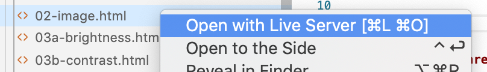

__Note: we've chosen to write all javascript in the html files themselves. While for projects, you might want to use a bundler, this is overkill for the quick demo and prototyping approach we're taking in this course.__

Read through the following chapters in WebGPU Fundamentals before continuing:

- [Fundamentals](https://webgpufundamentals.org/webgpu/lessons/webgpu-fundamentals.html)
- [Inter-stage Variables](https://webgpufundamentals.org/webgpu/lessons/webgpu-inter-stage-variables.html)
- [Uniforms](https://webgpufundamentals.org/webgpu/lessons/webgpu-uniforms.html)
- [Textures](https://webgpufundamentals.org/webgpu/lessons/webgpu-textures.html) & [Loading Images](https://webgpufundamentals.org/webgpu/lessons/webgpu-importing-textures.html)

## Showing an image

Open up [02-image.html](2d/02-image.html) in VSCode and go through the code.

You'll notice a couple of things:

```javascript
if (!navigator.gpu) {
  document.body.textContent = 'WebGPU is not supported in this browser';
  throw new Error('WebGPU not supported');
}
const adapter = await navigator.gpu.requestAdapter();
const device = await adapter.requestDevice();
```

Getting access to the GPU is an asynchronous process: we ask for an **adapter** (a physical GPU) and request a **device** from it. The device is the object we'll use to create everything else. Because we're using `await` at the top level of our script, our script tag has `type="module"`.

```javascript
const context = canvas.getContext('webgpu');
const format = navigator.gpu.getPreferredCanvasFormat();
context.configure({ device, format, alphaMode: 'premultiplied' });
```

We're getting the context from the canvas as a webgpu context and connect it to our device. You might have used `2d` contexts before, which would run on the CPU. WebGPU contexts will work with shader programs, on the GPU.

```javascript
const shaderModule = device.createShaderModule({ code: `
  ...
`});
```

This block compiles a WGSL string to a **shader module**. Both the vertex shader and the fragment shader live in the same piece of code. Let's look at the vertex shader part first:

```wgsl
struct VertexOutput {
  @builtin(position) position: vec4f,
  @location(0) uv: vec2f,
};

@vertex
fn vertexMain(@builtin(vertex_index) vertexIndex: u32) -> VertexOutput {
  // 2 triangles, filling the whole canvas
  let positions = array(
    vec2f(-1.0,  1.0),
    vec2f( 1.0,  1.0),
    vec2f(-1.0, -1.0),

    vec2f(-1.0, -1.0),
    vec2f( 1.0,  1.0),
    vec2f( 1.0, -1.0),
  );
  let position = positions[vertexIndex];

  var output: VertexOutput;
  output.position = vec4f(position, 0.0, 1.0);
  // convert clip space (-1 to 1, y up) to uv space (0 to 1, y down)
  output.uv = vec2f(position.x + 1.0, 1.0 - position.y) * 0.5;
  return output;
}
```

- `@vertex fn vertexMain`: the function that runs for every vertex.
- `@builtin(vertex_index) vertexIndex: u32`: WebGPU tells us which vertex we're processing (0, 1, 2, ...). Instead of uploading the vertex positions in a buffer, we've hardcoded the 6 corner points of 2 triangles in the shader and pick one using this index. A triangle consists of 3 points. Two times 3 is 6. If we line up the triangles we draw a rectangle.
- `struct VertexOutput`: the values a vertex shader passes on to the fragment shader: you return them as a struct.
- `@builtin(position)`: the vertex position in [clip space](https://webgpufundamentals.org/webgpu/lessons/webgpu-fundamentals.html#a-clip-space) as a 4d coordinate (x, y, z, w). As we will be handling 2D logic at first, z is 0 and w is 1.
- `@location(0) uv`: an extra value we pass to the fragment shader: where to sample a color from the texture, in uv-coordinate space (values between 0 and 1). Note that the uv origin is at the top-left of the image, while clip space has its origin in the center with y pointing up. That's why we're doing a small calculation instead of just copying the position.

```wgsl
@group(0) @binding(1) var imageSampler: sampler;
@group(0) @binding(2) var image: texture_2d<f32>;

@fragment
fn fragmentMain(@location(0) uv: vec2f) -> @location(0) vec4f {
  return textureSample(image, imageSampler, uv);
}
```

This is the fragment shader part. A fragment shader is used to determine the target pixel color.

- `var image: texture_2d<f32>`: the pixels to use as input. In this chapter we will be using images (or videos) as input.
- `var imageSampler: sampler`: **how** to read the texture: which filtering to use, what to do outside of the 0-1 range, ... The texture holds the pixels, the sampler is a separate object describing how to read them.
- `@group(0) @binding(n)`: every external resource (textures, samplers, uniforms) gets a number. We'll use these numbers in our javascript to connect the actual data.
- `@location(0) uv: vec2f`: the value we got from the vertex shader.
- `-> @location(0) vec4f`: the function returns the target pixel color as a 4d vector (r, g, b, a).
- `textureSample(...)`: In this example we're just taking the color of the pixel in the texture.

```javascript
const pipeline = device.createRenderPipeline({
  layout: 'auto',
  vertex: { module: shaderModule, entryPoint: 'vertexMain' },
  fragment: { module: shaderModule, entryPoint: 'fragmentMain', targets: [{ format }] },
});
```

A **render pipeline** combines the two shaders with some extra settings, such as the pixel format we're drawing to. `layout: 'auto'` tells WebGPU to figure out the bindings (`@group` / `@binding`) from the shader code itself.

```javascript
const sampler = device.createSampler({
  magFilter: 'linear',
  minFilter: 'linear',
  addressModeU: 'clamp-to-edge',
  addressModeV: 'clamp-to-edge',
});
```

The sampler: read the texture with linear interpolation, and when sampling outside the 0-1 range, repeat the pixels at the edge. (Try switching to `'nearest'` filtering once you've got the displacement effects working later on, you'll see the difference.)

```javascript
const createTextureFromImage = (image) => {
  const texture = device.createTexture({
    size: [image.width, image.height],
    format: 'rgba8unorm',
    usage: GPUTextureUsage.TEXTURE_BINDING | GPUTextureUsage.COPY_DST | GPUTextureUsage.RENDER_ATTACHMENT,
  });
  device.queue.copyExternalImageToTexture({ source: image }, { texture }, [image.width, image.height]);
  return texture;
};
```

This function creates an empty texture on the GPU with the size of the image, and copies the image pixels into it. The `usage` flags tell WebGPU what we plan to do with the texture (read it in a shader, copy data into it). `loadImage` is a small helper, which fetches the image file and decodes it into an `ImageBitmap`.

```javascript
bindGroup = device.createBindGroup({
  layout: pipeline.getBindGroupLayout(0),
  entries: [
    { binding: 1, resource: sampler },
    { binding: 2, resource: texture.createView() },
  ],
});
```

A **bind group** connects our actual resources to the `@binding` numbers in the shader.

```javascript
const drawScene = () => {
  const encoder = device.createCommandEncoder();
  const pass = encoder.beginRenderPass({
    colorAttachments: [{
      view: context.getCurrentTexture().createView(),
      clearValue: [0, 0, 0, 0],
      loadOp: 'clear',
      storeOp: 'store',
    }],
  });
  pass.setPipeline(pipeline);
  pass.setBindGroup(0, bindGroup);
  pass.draw(6); // 2 triangles = 6 vertices
  pass.end();
  device.queue.submit([encoder.finish()]);

  requestAnimationFrame(drawScene);
};
```

This is our render loop, executed on `requestAnimationFrame`. WebGPU doesn't execute commands immediately: we record them in a **command encoder** and submit them all at once. Here we're starting a render pass which clears the canvas, select our pipeline and bind group and draw 6 vertices.

__Note: this is a lot of boilerplate code to show an image on the screen. Most of our work during this chapter will be happening in the fragment shader code and providing our fragment shader with extra inputs (uniforms).__

> If something goes wrong, WebGPU will tell you in the devtools console. A typo in your WGSL results in a message such as `Error while parsing WGSL: :42:18 error: struct member effectFacor not found`, together with the line of code it's complaining about. Note that the line number is relative to the start of the shader string, not the html file.

## Basic color adjustments

The most important job of the fragment shader is returning a 4d color vector. In the show image boilerplate code, we sample a color from a texture and return that unmodified color.

You can do basic image color manipulation, by modifying the value of that sampled color.

For example: you could set the red component to full red:

```wgsl
@fragment
fn fragmentMain(@location(0) uv: vec2f) -> @location(0) vec4f {
  var sampleColor = textureSample(image, imageSampler, uv);
  sampleColor.r = 1.0;
  return sampleColor;
}
```

Note that we've changed `let` to `var`: a `let` in WGSL is a constant, you can only modify a `var`.

You should see an image with the red channel boosted to max:

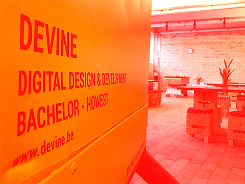

Let's implement the classic color adjustments: brightness, contrast, channel flip, saturation and hue. Each of them is a small WGSL function which takes the sampled color (and an adjustment amount) and returns the modified color. Add the function to the top section of your shader, and apply it to the sampled color inside `fragmentMain`.

> **WGSL gotcha**: you can't assign to multiple components of a `var` at once: `sampleColor.rgb = ...` is not allowed. Build a new vector instead: `sampleColor = vec4f(adjustBrightness(sampleColor.rgb, 0.5), sampleColor.a);`

### Brightness

The simplest adjustment: add the same value to every channel. A value of -1 makes the image fully black, 0 leaves it unchanged, 1 makes it fully white.

```wgsl
fn adjustBrightness(color: vec3f, value: f32) -> vec3f {
  return color + value;
}
```

Call it on the sampled color in `fragmentMain`:

```wgsl
@fragment
fn fragmentMain(@location(0) uv: vec2f) -> @location(0) vec4f {
  var sampleColor = textureSample(image, imageSampler, uv);
  sampleColor = vec4f(adjustBrightness(sampleColor.rgb, 0.5), sampleColor.a);
  return sampleColor;
}
```

### Contrast

Contrast pushes each channel away from (or towards) middle gray. We scale the distance between the color and 0.5: a value of -1 collapses the image to flat gray, 0 leaves it unchanged, positive values make dark pixels darker and bright pixels brighter. The `clamp` keeps the result in the 0–1 range.

```wgsl
fn adjustContrast(color: vec3f, contrast: f32) -> vec3f {
  let c = contrast + 1.0;
  return clamp(0.5 + c * (color - 0.5), vec3f(0), vec3f(1));
}
```

```wgsl
@fragment
fn fragmentMain(@location(0) uv: vec2f) -> @location(0) vec4f {
  var sampleColor = textureSample(image, imageSampler, uv);
  sampleColor = vec4f(adjustContrast(sampleColor.rgb, 0.5), sampleColor.a);
  return sampleColor;
}
```

### Channel flip

You can access the components of a vector in any order you like — this is called **swizzling**: `sampleColor.rgb` gives you the color as-is, `sampleColor.bgr` gives you the same color with the red and blue channels swapped. By mixing between the two, you can fade between the original and the flipped colors — no helper function needed. With `value` 1 you get the original image, with 0 the flipped one:

```wgsl
@fragment
fn fragmentMain(@location(0) uv: vec2f) -> @location(0) vec4f {
  var sampleColor = textureSample(image, imageSampler, uv);
  let value = 0.0; // 1.0 = original colors, 0.0 = red and blue swapped
  sampleColor = vec4f(sampleColor.rgb * value + sampleColor.bgr * (1.0 - value), sampleColor.a);
  return sampleColor;
}
```

### Saturation & hue

Saturation and hue can't be handled with simple per-channel math: they only make sense in a color space built around the color wheel. We convert the color from RGB to **HSL** — hue (the position on the color wheel), saturation (how intense the color is) and lightness — apply our adjustment there, and convert back to RGB:

```wgsl
struct HSL {
  h: f32,
  s: f32,
  l: f32,
};

fn rgbToHsl(rgb: vec3f) -> HSL {
  let cMin = min(min(rgb.r, rgb.b), rgb.g);
  let cMax = max(max(rgb.r, rgb.b), rgb.g);
  let delta = cMax - cMin;
  let l = (cMax + cMin) / 2.0;
  if (delta == 0.0) {
    return HSL(0, 0, l);
  }
  var h = 0.0;
  if (rgb.r == cMax) {
    h = (rgb.g - rgb.b) / delta;
  } else if (rgb.g == cMax) {
    h = 2.0 + (rgb.b - rgb.r) / delta;
  } else {
    h = 4.0 + (rgb.r - rgb.g) / delta;
  }
  h = h / 6.0;
  let s = delta / (1.0 - abs(2.0 * l - 1.0));
  return HSL(h, s, l);
}

fn hslToRgb(hsl: HSL) -> vec3f {
  let c = vec3f(fract(hsl.h), clamp(vec2f(hsl.s, hsl.l), vec2f(0), vec2f(1)));
  let rgb = clamp(abs((c.x * 6.0 + vec3f(0.0, 4.0, 2.0)) % 6.0 - 3.0) - 1.0, vec3f(0), vec3f(1));
  return c.z + c.y * (rgb - 0.5) * (1.0 - abs(2.0 * c.z - 1.0));
}

fn adjustHSL(color: vec3f, adjust: HSL) -> vec3f {
  let hsl = rgbToHsl(color);
  return hslToRgb(HSL(hsl.h + adjust.h, hsl.s + adjust.s, hsl.l + adjust.l));
}
```

Adjusting the saturation is adding a value to the `s` component (-1 = grayscale, 0 = unchanged, positive = oversaturated):

```wgsl
@fragment
fn fragmentMain(@location(0) uv: vec2f) -> @location(0) vec4f {
  var sampleColor = textureSample(image, imageSampler, uv);
  sampleColor = vec4f(adjustHSL(sampleColor.rgb, HSL(0.0, 0.5, 0.0)), sampleColor.a);
  return sampleColor;
}
```

Adjusting the hue is adding a value to the `h` component — this rotates every color around the color wheel. The hue wraps around, so a value of 0.5 gives you the complementary colors and 1.0 brings you back to the original image:

```wgsl
@fragment
fn fragmentMain(@location(0) uv: vec2f) -> @location(0) vec4f {
  var sampleColor = textureSample(image, imageSampler, uv);
  sampleColor = vec4f(adjustHSL(sampleColor.rgb, HSL(0.5, 0.0, 0.0)), sampleColor.a);
  return sampleColor;
}
```

> The RGB ↔ HSL conversion functions come from the [WebGPU Image Adjustments lesson on webgpufundamentals.org](https://webgpufundamentals.org/webgpu/lessons/webgpu-image-adjustments.html). Treat them as utility code — you don't need to memorize them.

### Interactive colour correction

Let's make the amount of brightness, contrast, saturation and / or hue interactive. You can pass values to the shader by providing uniform values. In WebGPU, all uniforms of a shader are grouped in a struct, which is stored in a **uniform buffer**.

Define a uniforms struct in the top section of your shader, and bind it to `@binding(0)`:

```wgsl
struct Uniforms {
  effectFactor: f32,
};
@group(0) @binding(0) var<uniform> uniforms: Uniforms;
```

Use that uniform value as the value for your effect, e.g. brightness adjustment function:

```wgsl
sampleColor = vec4f(adjustBrightness(sampleColor.rgb, uniforms.effectFactor), sampleColor.a);
```

In the global scope of your javascript code, you'll create the buffer which holds the uniform values, and a variable where you'll store the real javascript value:

```javascript
// the offsets (in floats) of each uniform value, must match the Uniforms struct in the shader
const uniforms = { effectFactor: 0 };
const uniformValues = new Float32Array(4);
const setUniform = (name, ...values) => uniformValues.set(values, uniforms[name]);
const uniformBuffer = device.createBuffer({
  size: uniformValues.byteLength,
  usage: GPUBufferUsage.UNIFORM | GPUBufferUsage.COPY_DST,
});

let effectFactor = 0;
```

`uniformValues` is a plain array of floats, which mirrors the struct in the shader. The `uniforms` object holds the position of each value in that array, so we can write `setUniform('effectFactor', 0.5)` instead of `uniformValues[0] = 0.5`.

> **Uniform buffer layout**: WebGPU is strict about where each value lives in the buffer:<br />- an `f32` takes 1 float<br />- a `vec2f` takes 2 floats, and must start at an even position<br />- a `vec4f` takes 4 floats and a `mat4x4f` takes 16 floats, both must start at a multiple of 4<br />- the total size must be a multiple of 4 floats (16 bytes)<br /><br />An easy rule of thumb: order your struct from big to small (matrices, then vec4, vec2 and finally the single floats) and you'll never have to worry about padding. Avoid `vec3f` in uniform structs, it takes 3 floats but is aligned to 4.

Add the uniform buffer to your bind group, so the shader can access it:

```javascript
bindGroup = device.createBindGroup({
  layout: pipeline.getBindGroupLayout(0),
  entries: [
    { binding: 0, resource: { buffer: uniformBuffer } },
    { binding: 1, resource: sampler },
    { binding: 2, resource: texture.createView() },
  ],
});
```

In the `init()` function, you'll listen for mouse move events, and calculate a value between -1 and 1 depending on the horizontal mouse position.

```javascript
canvas.addEventListener('mousemove', (e) => {
  // TODO!!
  // check the e object to determine which property you can use for the x position
  // map this to a range between -1 and 1 (we've provided a map function)
  // set the effectFactor variable
});
```

In our `drawScene()` loop, we copy the value into our array, and upload the whole array to the GPU, before recording the render pass:

```javascript
setUniform('effectFactor', effectFactor);
device.queue.writeBuffer(uniformBuffer, 0, uniformValues);
```

> In WebGPU, uniforms and attributes are used to pass data to shaders, but they serve different purposes.<br /><br />**Attributes** are used to pass per-vertex data to the vertex shader. Each vertex can have different attribute values. We'll see them in the vertex shader chapter.<br />**Uniforms** are per-primitive parameters (constant during an entire draw call). They are often used for transformation matrices, lighting parameters, or other global settings.

You should end up with something like this:

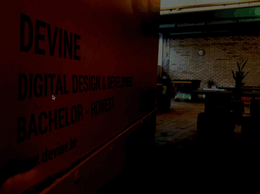

You can check out our solutions for the different adjustments: [brightness](2d/03a-brightness.html), [contrast](2d/03b-contrast.html), [channel flip](2d/03c-flip.html), [saturation](2d/03d-saturation.html) and [hue](2d/03e-hue.html).

### Color Matrix

Next up, we're going to be using color matrices as a more flexible way of modifying our target color. Adjustments such as brightness, contrast and exposure are **linear** operations: each of them is just a multiplication and / or addition of our original color:

```
newColor = matrix * color + offset
```

By using matrices, we can get rid of the separate formulas in our shader, and use a matrix input which will contain the multiplication and / or sum factors. Even better: we can **combine** multiple adjustments into a single matrix and offset by multiplying the matrices and adding the offsets — the shader stays one line of math, no matter how many adjustments we stack.

Build a simple slider ui, so you can modify brightness, contrast, exposure and saturation from your javascript code.

Adjust the fragment shader to use a matrix and offset:

```wgsl
struct Uniforms {
  matrix: mat4x4f,
  offset: vec4f,
};
@group(0) @binding(0) var<uniform> uniforms: Uniforms;
@group(0) @binding(1) var imageSampler: sampler;
@group(0) @binding(2) var image: texture_2d<f32>;

@fragment
fn fragmentMain(@location(0) uv: vec2f) -> @location(0) vec4f {
  let sampleColor = textureSample(image, imageSampler, uv);
  return uniforms.matrix * sampleColor + uniforms.offset;
}
```

Update the uniform layout in your javascript: the matrix takes 16 floats, the offset 4:

```javascript
const uniforms = { matrix: 0, offset: 16 };
const uniformValues = new Float32Array(20);
```

We can calculate the effect matrix (eg brightess x contrast x exposure x saturation) once in our javascript code, and send in that effect matrix.

[Download gl-matrix](http://glmatrix.net) and extract it in your project folder (we've included a copy in [2d/js/gl-matrix](2d/js/gl-matrix)).

Import vec4 and mat4 from gl-matrix in your javascript code (our script tag already has `type="module"`, so we can use imports):

```html
<script type="module">
    import * as mat4 from "./js/gl-matrix/mat4.js";
    import * as vec4 from "./js/gl-matrix/vec4.js";

    const canvas = document.querySelector('#c');

    // etc...
```

Create the matrices and offsets for each of the filters and the final matrix and offset:

```javascript
const matrix = mat4.create();
const offset = vec4.create();

const u_brightnessMatrix = mat4.create();
const u_brightnessOffset = vec4.create();

const u_contrastMatrix = mat4.create();
const u_contrastOffset = vec4.create();

const u_exposureMatrix = mat4.create();
const u_exposureOffset = vec4.create();

const u_saturationMatrix = mat4.create();
const u_saturationOffset = vec4.create();
```

These create methods create an identity matrix and a zero vector. You can use these as a starting point for your calculations.

```javascript
mat4.identity(matrix);
mat4.multiply(matrix, matrix, u_brightnessMatrix);
mat4.multiply(matrix, matrix, u_contrastMatrix);
mat4.multiply(matrix, matrix, u_exposureMatrix);
mat4.multiply(matrix, matrix, u_saturationMatrix);

vec4.zero(offset);
vec4.add(offset, offset, u_brightnessOffset);
vec4.add(offset, offset, u_contrastOffset);
vec4.add(offset, offset, u_exposureOffset);
vec4.add(offset, offset, u_saturationOffset);

// our matrices are built row by row, but WGSL expects them column by column
mat4.transpose(matrix, matrix);
setUniform('matrix', ...matrix);
setUniform('offset', ...offset);
device.queue.writeBuffer(uniformBuffer, 0, uniformValues);
```

> Our slider code fills the matrices row by row: the first 4 numbers are the first row of the matrix. A `mat4x4f` in WGSL is stored column by column, so we transpose the matrix before uploading it. Alternatively, you could keep the matrix as is, and multiply the other way around in the shader: `sampleColor * uniforms.matrix`.

Each adjustment has its own matrix and offset "recipe". They follow directly from the formulas you used earlier — just read off which factors multiply the color and which values are added to it:

- **brightness** *b*: identity matrix, offset `(b, b, b, 0)` — we're just adding a value to each channel.
- **contrast** *c*: put `c` on the matrix diagonal, offset `((1 - c) / 2, (1 - c) / 2, (1 - c) / 2, 0)` — this is `0.5 + c * (color - 0.5)` rewritten as `c * color + (1 - c) / 2`.
- **exposure** *e*: put `e` on the matrix diagonal, no offset — a plain multiplication of each channel.
- **saturation** *s*: mix each channel toward the luminance gray of the pixel, using the [WCAG relative luminance weights](https://www.w3.org/TR/WCAG21/#dfn-relative-luminance) `(0.2126, 0.7152, 0.0722)` (see the worked example below).

Write the necessary event handlers on the sliders to modify the matrices and offsets. For example, the contrast matrix and offset logic would be:

```javascript
$contrast.addEventListener('input', e => {
  const x = $contrast.value;
  const y = (1 - x) / 2;

  u_contrastMatrix[0] = x;
  u_contrastMatrix[5] = x;
  u_contrastMatrix[10] = x;
  u_contrastMatrix[15] = x;

  u_contrastOffset[0] = y;
  u_contrastOffset[1] = y;
  u_contrastOffset[2] = y;
});
```

The saturation matrix is the trickiest one. For a saturation factor `s`, each output channel becomes a mix between the pixel's luminance (a weighted gray value) and the original channel:

```javascript
$saturation.addEventListener('input', e => {
  // https://www.w3.org/TR/WCAG21/#dfn-relative-luminance
  const lr = 0.2126;
  const lg = 0.7152;
  const lb = 0.0722;

  const s = parseFloat($saturation.value);
  const sr = (1 - s) * lr;
  const sg = (1 - s) * lg;
  const sb = (1 - s) * lb;

  u_saturationMatrix[0] = sr + s;
  u_saturationMatrix[1] = sg;
  u_saturationMatrix[2] = sb;

  u_saturationMatrix[4] = sr;
  u_saturationMatrix[5] = sg + s;
  u_saturationMatrix[6] = sb;

  u_saturationMatrix[8] = sr;
  u_saturationMatrix[9] = sg;
  u_saturationMatrix[10] = sb + s;
});
```

At `s = 1` this is the identity matrix (no change), at `s = 0` every channel becomes the same luminance value (grayscale).

> **Note**: this is the *linear approximation* of saturation that color matrices (and libraries like PixiJS) use. Our HSL-based saturation from the [Saturation & hue section](#saturation--hue) can't be written as a matrix — converting to HSL and back is not a linear operation.

You can [check out the solution](2d/04a-color-matrix.html) when you're stuck.

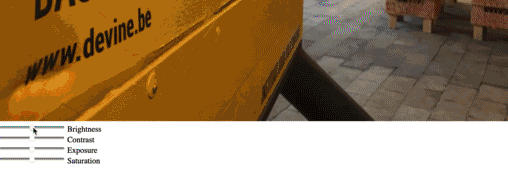

### Effects

Once you look at color adjustments as matrices, Instagram-style effects (sepia, noir, vintage, ...) turn out to be nothing more than **precalculated matrix + offset pairs**, plugged into the exact same shader. Instead of calculating the matrix values from a slider, you use a fixed set of numbers per effect.

You can find a couple of [effect matrices in the PixiJS ColorMatrixFilter class](https://github.com/pixijs/pixijs/blob/main/src/filters/defaults/color-matrix/ColorMatrixFilter.ts). Note that PixiJS stores each effect as a 4×5 matrix, row by row: the first 4 numbers of each row are the multiplication factors (a row of our `mat4`), the 5th number is the added value (a component of our `offset` vector).

Let's split one of them — sepia — step by step, starting from your color matrix solution ([04a-color-matrix.html](2d/04a-color-matrix.html)):

1. Remove the slider parts: the `<input type="range">` elements from the html, the four `u_...Matrix` / `u_...Offset` pairs with their `input` handlers, and the matrix / offset composition at the top of `drawScene()`. Keep the shader, the uniform layout and the `setUniform` / `writeBuffer` calls — they stay exactly the same.

2. Copy the sepia matrix from the PixiJS class into your javascript as a plain array. Write it as 4 rows of 5 numbers, so you can see the structure:

   ```javascript
   const sepia = [
     0.394, 0.769, 0.189, 0.000, 0.000,
     0.349, 0.686, 0.168, 0.000, 0.000,
     0.272, 0.534, 0.131, 0.000, 0.000,
     0.000, 0.000, 0.000, 1.000, 0.000,
   ];
   ```

3. Split it into our two uniforms: the first 4 numbers of each row go into the matrix, each row's 5th number goes into the offset. Replace your `matrix` and `offset` definitions:

   ```javascript
   const matrix = mat4.fromValues(
     sepia[0], sepia[1], sepia[2], sepia[3],
     sepia[5], sepia[6], sepia[7], sepia[8],
     sepia[10], sepia[11], sepia[12], sepia[13],
     sepia[15], sepia[16], sepia[17], sepia[18],
   );
   const offset = vec4.fromValues(sepia[4], sepia[9], sepia[14], sepia[19]);

   // the matrix is built row by row, but WGSL expects it column by column
   mat4.transpose(matrix, matrix);
   ```

   As before, we transpose because we filled the matrix row by row. The effect doesn't change while the app runs, so we can do this once at startup instead of on every frame.

4. `drawScene()` now only needs to upload the values:

   ```javascript
   setUniform('matrix', ...matrix);
   setUniform('offset', ...offset);
   device.queue.writeBuffer(uniformBuffer, 0, uniformValues);
   ```

You should see the image in sepia tones. You can [check out the solution](2d/04b-effect.html) when you're stuck. Try swapping in one of the other PixiJS effects (mono, noir, ...) — only the numbers change.

As a final exercise, we'll animate between our regular colors and the effect colors:

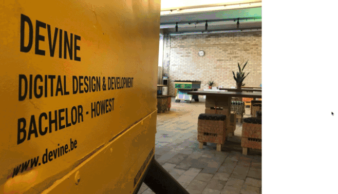

There's a builtin function in WGSL to interpolate between values: [the mix function](https://webgpufundamentals.org/webgpu/lessons/webgpu-wgsl-function-reference.html#mix).

First of all, we'll prepare our fragment shader. Add an extra uniform `effectFactor` at the end of the struct:

```wgsl
struct Uniforms {
  matrix: mat4x4f,
  offset: vec4f,
  effectFactor: f32,
};
```

This effectFactor will be a value between 0 and 1. 0 will be: use the original color, 1 will be: use the modified effect color. Values between that should interpolate between those 2 colors:

```wgsl
@fragment
fn fragmentMain(@location(0) uv: vec2f) -> @location(0) vec4f {
  let sampleColor = textureSample(image, imageSampler, uv);
  let filteredColor = uniforms.matrix * sampleColor + uniforms.offset;
  return mix(sampleColor, filteredColor, uniforms.effectFactor);
}
```

Add the effectFactor to the uniforms layout (at position 20, right after the offset) and make the `Float32Array` big enough. Remember: the total size needs to be a multiple of 4 floats, so 21 becomes 24:

```javascript
const uniforms = { matrix: 0, offset: 16, effectFactor: 20 };
const uniformValues = new Float32Array(24);
```

Create a global effectFactor variable. Add listeners to mouseover and mouseout to set that variable (we won't do animation in this first iteration):

```javascript
canvas.addEventListener('mouseover', e => {
  effectFactor = 1;
});

canvas.addEventListener('mouseout', e => {
  effectFactor = 0;
});
```

In the draw loop, you'll pass this effectFactor into the shader:

```javascript
setUniform('effectFactor', effectFactor);
```

You should see the colors switch on hover.

> You could also apply this effectFactor as an interpolation value in javascript, instead of in WGSL. This would even be more efficient in this particular case. However, it's good to know how to use the mix function in WGSL.

### Animated effect

To animate our effectFactor, we'll use [the GSAP animation library](https://gsap.com/docs/v3/).

Add a script tag before your own script tag to load it from a CDN:

```html
<script src="https://cdnjs.cloudflare.com/ajax/libs/gsap/3.15.0/gsap.min.js"></script>
```

If you take a look at [the GSAP docs](https://gsap.com/docs/v3/Eases/), you'll notice that GSAP works by modifying object properties. You can't animate a regular variable.

Modify the effectFactor definition to wrap it inside of an object:

```javascript
const properties = {
  effectFactor: 0
};
```

In the mouse events, you'll animate this property:

```javascript
gsap.to(properties, { duration: 1, ease: "power4.out", effectFactor: 1});
```

Don't forget to modify the code where you're passing the effectFactor into the shader:

```javascript
setUniform('effectFactor', properties.effectFactor);
```

You can [check out the final solution](2d/04c-effect-hover.html) when you're stuck.

### Going further: colour lookup tables (LUTs)

There's a third way to do colour adjustments, next to formulas and matrices: baking the transformation into a texture, called a lookup table (LUT). The [1D LUT lesson on webgpufundamentals.org](https://webgpufundamentals.org/webgpu/lessons/webgpu-1dlut.html) maps the luminance of each pixel through a gradient texture, giving you duotone and gradient-map effects. The [3D LUT lesson](https://webgpufundamentals.org/webgpu/lessons/webgpu-3dlut.html) goes all the way: a colour cube texture that can combine *all* of the adjustments and effects from this chapter into a single texture lookup — you can even load colour grades made in Photoshop or industry-standard Adobe `.cube` files. Recommended reading once you're comfortable with the material above.

## 2D Displacement maps

Another technique to modify pixel colors is through displacement maps. Instead of using a matrix or a buffer as an input modifier, you can use a second texture as a data source. You can use the color value of this second texture as a modification value for the sampled color of your main texture.

In the fragment shader, you'll have 2 images: the image itself and a displacement texture. Just give it the next free binding number:

```wgsl
@group(0) @binding(1) var imageSampler: sampler;
@group(0) @binding(2) var image: texture_2d<f32>;
@group(0) @binding(3) var dispTexture: texture_2d<f32>;
```

The sampling position gets influenced by the red channel of the displacement texture:

```wgsl
let disp = textureSample(dispTexture, imageSampler, uv);
let effectFactor = 0.05;
let distortedPosition = vec2f(uv.x + disp.r * effectFactor, uv.y);
return textureSample(image, imageSampler, distortedPosition);
```

In your javascript, you'll load the second image, create a texture from it and add it to your bind group as `binding: 3`. We can use the same sampler for both textures.

Applying a black and white displacement map such as the one below:

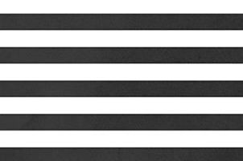

Would result in the effect below:

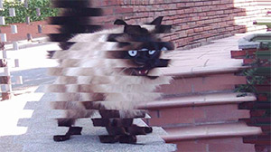

Things get even more interesting when you start animating the displacement factor from the shader. You can animate the uniform value on hover, like we did in the previous project:

```javascript
canvas.addEventListener('mouseover', () => gsap.to(properties, { duration: 1, ease: "power4.out", effectFactor: 1}));
canvas.addEventListener('mouseout', () => gsap.to(properties, { duration: 1, ease: "power4.out", effectFactor: 0}));
```

On hover, you'll get the following effect:


Try implementing this displacement effect by yourself. There's a couple of displacement maps for you to test in the [2d/images/displacement](2d/images/displacement) folder.

### Displacement transition between images

You could also mix 2 images using this displacement value. To do so, you would add yet another texture, so you'd have 3:

- image 1
- image 2
- displacement map

In the fragment shader logic, you would calculate 2 displacement positions. One of them being the inverse-effect-position (by doing 1.0 minus the displacement factor):

```wgsl
let disp = textureSample(dispTexture, imageSampler, uv);
let distortedPosition = vec2f(uv.x + uniforms.dispFactor * (disp.r * uniforms.effectFactor), uv.y);
let distortedPosition2 = vec2f(uv.x - (1.0 - uniforms.dispFactor) * (disp.r * uniforms.effectFactor), uv.y);
```

You would then use these two distortedPosition vectors to sample a color from each of the 2 images:

```wgsl
let _texture = textureSample(image, imageSampler, distortedPosition);
let _texture2 = textureSample(image2, imageSampler, distortedPosition2);
```

And use the mix function to interpolate between the two:

```wgsl
return mix(_texture, _texture2, uniforms.dispFactor);
```

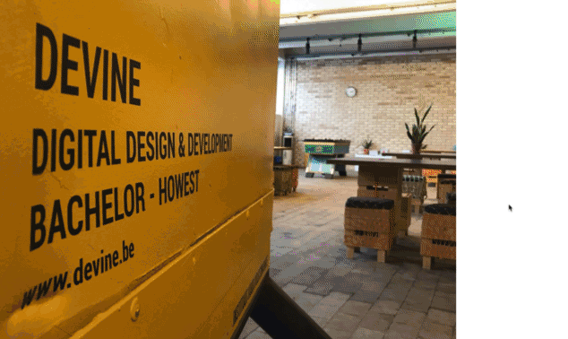

## Ripple effect

Up until now, we've used textures as input for our origin image and displacement map. Using some creative math, you can also generate pixel colors yourself.

Restart from the basic show image project.

We'll create some concentric ovals, using just math. In your fragment shader, calculate the distance of the uv coordinate to the center uv:

```wgsl
let dist = length(uv - vec2f(0.5, 0.5));
```

(we're not calling it `distance`, as that's the name of a builtin function in WGSL)

Using a `sin` function, we can calculate the sine waveform from that distance. When multiplying this with a vec4f and returning that as the color you can visualize the results:

```wgsl
var disp = vec4f(1.0, 1.0, 1.0, 1.0);
disp = vec4f(disp.rgb * sin(dist), disp.a);
return disp;
```

> We can't write `disp.rgb *= sin(dist);` in WGSL, as you can't assign to multiple components of a vector at once. So we build a new vec4f out of the modified rgb and the original alpha.

You should see a fade from a black center to a grey border:

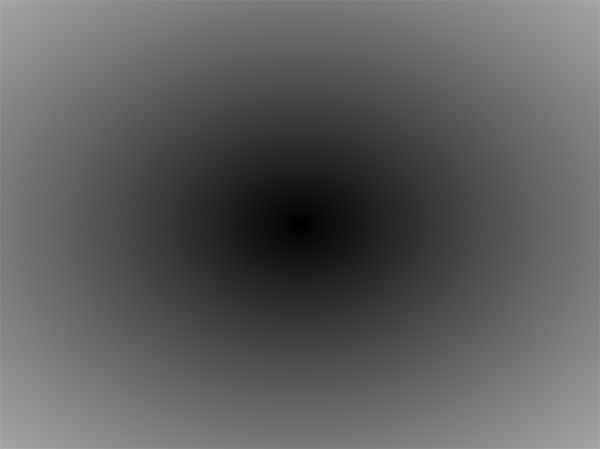

> You'll notice the solution still samples the image, without using the result. With `layout: 'auto'`, WebGPU only creates bindings for the resources your shader actually uses. If we'd drop the `textureSample` call, binding 2 would no longer exist and our bind group would be invalid. You'd get an error such as `In entries[1], binding index 2 not present in the bind group layout.` Keep the sample call, or remove the texture from your bind group.

Our distance will be a value between 0 and 0.5, which is quite a small range for the sine function. If you multiply this value with a larger number, things become more interesting:

```wgsl
disp = vec4f(disp.rgb * sin(dist * 20.0), disp.a);
```

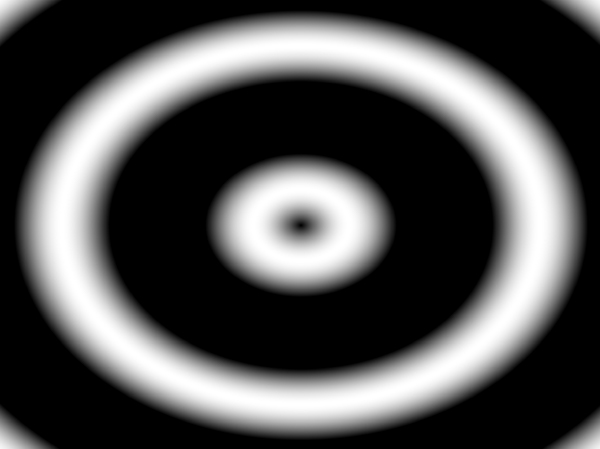

We can animate these circles, by adding a "phase offset" to the sine calculation.

Define a new uniform float phase:

```wgsl
struct Uniforms {
  phase: f32,
};
@group(0) @binding(0) var<uniform> uniforms: Uniforms;
```

And add this uniform value to the sine calculation:

```wgsl
disp = vec4f(disp.rgb * sin(dist * 20.0 + uniforms.phase), disp.a);
```

In your javascript, you'll need to create the uniform buffer again and add it to the bind group, as we did before.

In the drawloop, we'll update this value. You can take advantage of the fact that requestAnimationFrame receives a timing offset in the function call. So change the signature of the drawScene to capture this time:

```javascript
const drawScene = (time = 0) => {
```

And pass it to the phase uniform, before writing the uniform buffer. Make sure to divide it by a factor, otherwise the circle will move too fast:

```javascript
setUniform('phase', time / 100);
device.queue.writeBuffer(uniformBuffer, 0, uniformValues);
```

You should see the circles moving:

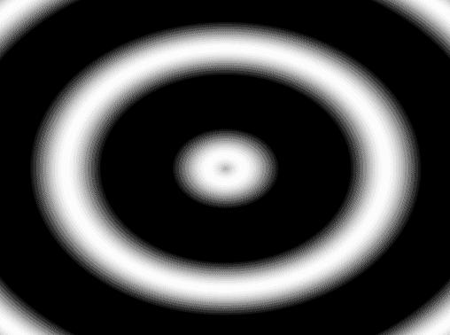

We've now got an animating, black and white image... We can use this as an input for a displacement effect!

Take a look at the previous exercise, where you used a texture value as displacement factor (the single image, not the transition between images). Use our concentric circle as the displacement factor. You should have the following result:

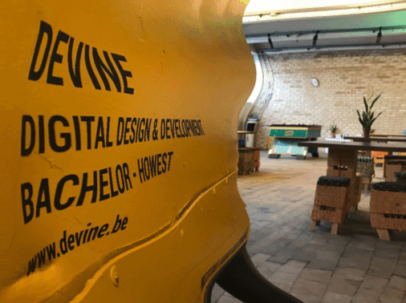

As a final step, try adding hover interaction to the page, so the effect only triggers when hovering over the image.

## Warp effect

As a next exercise, we want to create a warp effect - as described at https://stackoverflow.com/questions/46857876/old-school-tv-edge-warping-effect

Start off from the [basic image example](2d/02-image.html). We're only interested in the warping effect, we'll ignore the horizontal stripes and color shift.

In the stackoverflow post you'll find the following block of shader code:

```glsl
vec2 ndc_pos = vertPos;
vec2 testVec = ndc_pos.xy / max(abs(ndc_pos.x), abs(ndc_pos.y));
float len = max(1.0,length( testVec ));
ndc_pos *= mix(1.0, mix(1.0,len,max(abs(ndc_pos.x), abs(ndc_pos.y))), u_distortion);
vec2 texCoord = vec2(ndc_pos.s, -ndc_pos.t) * 0.5 + 0.5;
```

This is GLSL code, so we'll need to translate it to WGSL:

```wgsl
var ndc_pos = vertPos;
let testVec = ndc_pos.xy / max(abs(ndc_pos.x), abs(ndc_pos.y));
let len = max(1.0, length(testVec));
ndc_pos *= mix(1.0, mix(1.0, len, max(abs(ndc_pos.x), abs(ndc_pos.y))), uniforms.distortion);
let texCoord = vec2f(ndc_pos.x, -ndc_pos.y) * 0.5 + 0.5;
```

Note that `ndc_pos` is a `var` (it gets modified), and that `.s` and `.t` don't exist in WGSL: use `.x` and `.y`.

In the shader code above, they're using the xy vertex position in the fragment shader. In order to access this, you can pass it from the vertex shader to the fragment shader.

Add a `vertPos` to your VertexOutput struct, and set it at the end of your __vertex__ shader:

```wgsl
struct VertexOutput {
  @builtin(position) position: vec4f,
  @location(0) uv: vec2f,
  @location(1) vertPos: vec2f,
};

// ...
output.vertPos = position;
```

And receive it in your __fragment__ shader:

```wgsl
fn fragmentMain(@location(0) uv: vec2f, @location(1) vertPos: vec2f) -> @location(0) vec4f {
```

You'll need a `distortion` uniform in the fragment shader as well:

```wgsl
struct Uniforms {
  distortion: f32,
};
```

Set it up in your javascript code, and initialize it to a value of 1.0. You should see something like this:

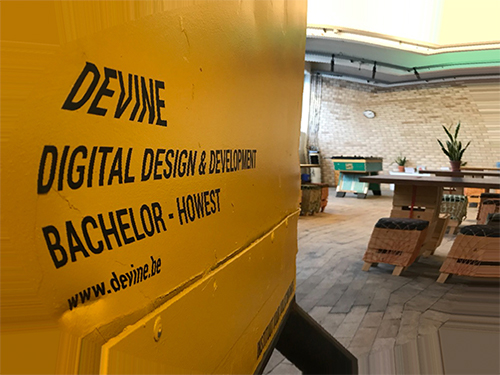

If you take a closer look at the edges, you'll notice that the pixels are repeating (for example: look at the floor on the bottom right of the image). That's because our shader is sampling colors outside of the 0-1 uv coordinate space, and the sampler (`clamp-to-edge`) falls back to the last available pixel for the edge.

A quick approach is by adding a couple of if-statements and multiplying the color by 0 if the `texCoord` falls outside of our 0-1 range:

```wgsl
var sampleColor = textureSample(image, imageSampler, texCoord);

if (texCoord.x < 0.0) {
  sampleColor *= 0.0;
}

return sampleColor;
```

Write the 3 other statements checking if x and y are between 0 and 1. You should see the following result:

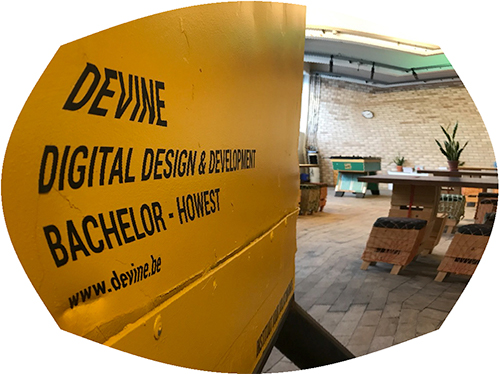

We're kind of there... but not quite yet. You'll see some heavy aliasing at the edges.

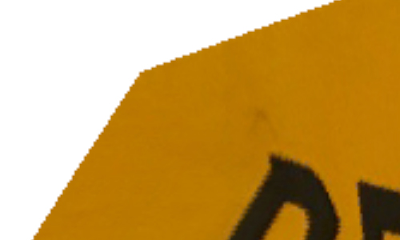

This is happening because we straight going from a full color to none. We can get rid of this by using a slight "gradient" at the edges.

To make coding a little easier, we'll make our mask visible instead of the resulting image. Replace your previous if/else logic, with the following:

```wgsl
var mask = 1.0;

if (texCoord.x < 0.0) {
  mask = 0.0;
}
if (texCoord.x > 1.0) {
  mask = 0.0;
}
if (texCoord.y < 0.0) {
  mask = 0.0;
}
if (texCoord.y > 1.0) {
  mask = 0.0;
}

let maskPreview = vec4f(mask, mask, mask, 1.0);

return maskPreview;
```

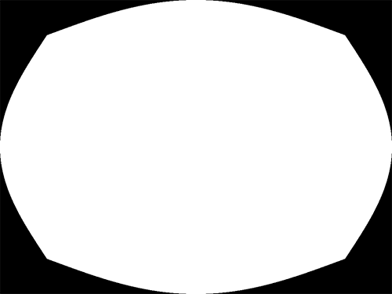

An alternative approach to using if/else statements, is using [the step function](https://thebookofshaders.com/glossary/?search=step). This function takes 2 parameters: an edge (threshold value) and a value. Read more about this at [https://thebookofshaders.com/glossary/?search=step](https://thebookofshaders.com/glossary/?search=step) (the Book of Shaders is written for GLSL, but these functions work exactly the same in WGSL).

Replace the if/else statements, with the following step function call

```wgsl
var mask = 1.0;
mask *= step(0.0, texCoord.x);
```

This should give you the result below:

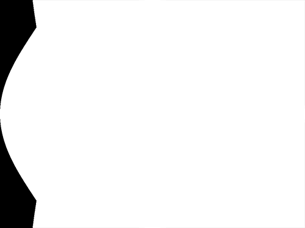

Try figuring out the other 3 step function calls, so you get the same mask as before:


You can [take a peek at the solution](2d/07d-warp-mask-step.html) if you're stuck.

Ok, we're back to an aliased mask... but what we want is a small gradient at the edges. This is where [smoothstep](https://thebookofshaders.com/glossary/?search=smoothstep) comes in. This function expects 3 parameters: 2 parameters describing your threshold space (min and max threshold) and a value. It will create a smooth interpolation for values within the threshold space. Read more about this at [https://thebookofshaders.com/glossary/?search=smoothstep](https://thebookofshaders.com/glossary/?search=smoothstep).

Try implementing this smoothstep yourself, and aim for the following result:


As always, there's a [solution of the current state](2d/07e-warp-mask-smoothstep.html) available.

If you'd apply the calculated mask float with the sampleColor

```wgsl
return sampleColor * mask;
```

you'd get a masked version of the image:

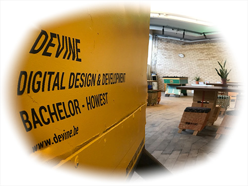

We're almost there! Try making the gradient space as small as possible (find the sweet spot between having a small gradient and an aliased edge). See if you can get the warp activate on hover, so you get the following effect:

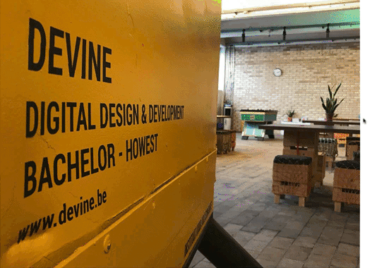

## Interactive Masks

As you've seen in the previous exercise, masking in a fragment shader is quite easy: multiply your fragment color with a value between 0 and 1, and you've got a mask.

Let's start from the basic image example again and build our way up.

We've prepared a small black-and-white image, which we'll use as our mask:


1. Load this image as an extra texture (binding 3)
2. Sample it's color at the same uv coordinate as the texture
3. Use it's red channel as your mask multiplier

You should get the following result:

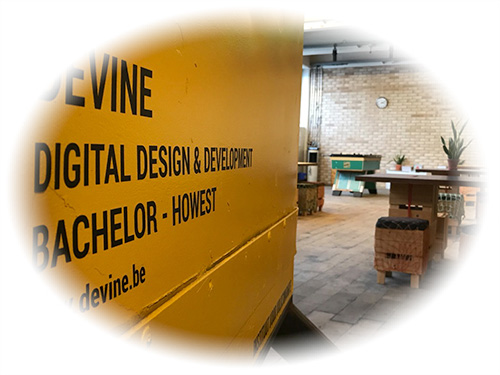

By taking the same UV coordinates as the image, we're stretching the mask. We want to keep the original mask size.

To do this, we'll need to know the original size of the mask and the original size of the image.

Create 2 uniforms in your fragment shader to store these sizes:

```wgsl
struct Uniforms {
  textureSize: vec2f,
  maskSize: vec2f,
};
```

In your init function, right after creating your two textures, you should set these uniforms. You'll need to set up the uniform buffer and its layout as well, but I figure you know how to do this by now 😉:

```javascript
setUniform('textureSize', imgTexture.width, imgTexture.height);
setUniform('maskSize', imgMask.width, imgMask.height);
```

Back to the fragment shader. We can now use these sizes to calculate the uv coordinate we need to use in for the mask sample:

```wgsl
let maskScale = uniforms.maskSize / uniforms.textureSize;
let maskCoord = uv / maskScale;
```

Use this maskCoord as the sample location in your mask texture, so you get the following result:


Our next step is making the mask follow the cursor position. Add an additional uniform to use as an offset for our mask:

```wgsl
struct Uniforms {
  textureSize: vec2f,
  maskSize: vec2f,
  maskOffset: vec2f,
};
```

and use this maskOffset in the calculation of the maskCoord:

```wgsl
let maskCoord = (uv - uniforms.maskOffset) / maskScale;
```

In your init function, you'll add a listener to the `mousemove` event, where you'll set this maskOffset. Try figuring out the correct calculation, based on the event properties, the size of the mask and the size of the canvas. The resulting values should be within the 0-1 coordinate space!

```javascript
canvas.addEventListener('mousemove', e => {
  const maskX = // TODO: calculate relative offset x
  const maskY = // TODO: calculate relative offset y

  console.log(maskX, maskY);

  setUniform('maskOffset', maskX, maskY);
});
```

Note that you don't need to write the uniform buffer in the listener: our `drawScene` loop uploads the whole `uniformValues` array every frame anyway.


We can also apply distortion effects to our mask. Remember the ripple effect with the circles? When applying this to the mask coordinate, you can get a more interesting animated mask.

```wgsl
let dist = length(uv - vec2f(0.5));
var disp = vec4f(0.01, 0.01, 0.01, 0.01);
disp = vec4f(disp.rgb * sin(dist * 25.0 + uniforms.phase), disp.a);

let distortedPosition = vec2f(uv.x + disp.r * uniforms.effectFactor, uv.y + disp.r * uniforms.effectFactor);

let maskScale = uniforms.maskSize / uniforms.textureSize;
let maskCoord = (distortedPosition - uniforms.maskOffset) / maskScale;
```

Try incorporating the distortion to the mask, so you get the following result:

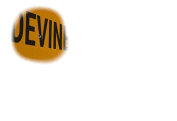

> Tip: our sampler uses `clamp-to-edge`, so outside of the mask image you'll see its edge pixels repeated. You can fix this with a couple of if-statements which set `maskColor.r` to 0 when maskCoord is outside of the 0-1 range. Remember that in WGSL, the curly braces of an if-statement are not optional!

## Selective translation

Another technique we can use it show another region of an image under the mask.

Take a look at the image below (graphics for Volkswagen project by [Bavo Vanderghote](https://www.behance.net/bavo)):

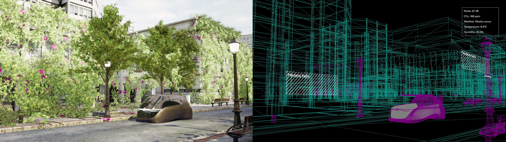

The left part of the image is a rendered frame, the right part of the image is the wireframe version.

We'll display the rendered section for the most part, underneath our mask we'll show the wireframe version.

Start from [the solution of the previous exercise](2d/08c-mask-animated.html) and load [the volkswagen image](2d/images/vw.jpg) instead.

The canvas is quite large, so auto-size it to the width of the body using some css:

```html
<style>
  canvas {
    width: 100%;
    height: auto;
  }
</style>
```

In your fragment shader, you'll calculate a new UV coordinate for the left part of the image:

```wgsl
let leftUV = vec2f(uv.x / 2.0, uv.y);
```

Use this `leftUV` coordinate for the color sampling, and comment out the masking factor for now:

```wgsl
return textureSample(image, imageSampler, leftUV); // * maskColor.r;
```

You should get the following result:


We're only seeing the left part, but it is stretched to double it's width. This is because we're using the full width of the image for the textureSize __and__ the canvas.

Adjust the javascript code to divide the width here as well:

```javascript
setUniform('textureSize', imgTexture.width / 2, imgTexture.height);

canvas.width = imgTexture.width / 2;
```

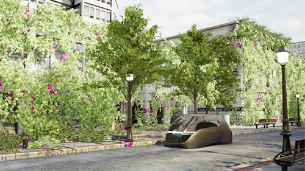

Calculate a `rightUV` as well for displaying the right side of the image, and test rendering this image sample as well:

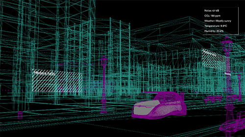

Let's add the masking interaction again. What we'll do is sample both the leftUV and rightUV coordinate, and mix the colors depending on the masking value:

```wgsl
return mix(textureSample(image, imageSampler, leftUV), textureSample(image, imageSampler, rightUV), maskColor.r);
```

Test the app. You'll notice we're kind-of there, but the mouse coordinates are off for some reason:

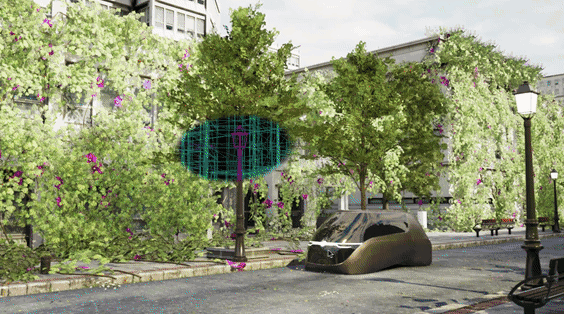

This has to do with the fact that we've resized our canvas using css. We need to calculate the resulting canvas scale, and apply this scaling to our mouse coordinate as well.

You can calculate the scaling ratio in the mouse move handler as follows:

```javascript
const canvasSize = canvas.getBoundingClientRect();
const canvasScale = canvas.width / canvasSize.width;
```

See where to apply the `canvasScale` number to, in order to get the coordinates working again:

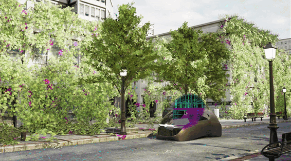

## Using videos as textures

You're not just limited to static images as textures: you can use videos as well.

Start off from [the ripple effect solution](2d/06d-ripple-final.html).

We won't be adding a video tag to the page: the WebGPU canvas will be our video display, so there's no need to show the video element itself. Instead, create a video element in javascript, purely as a source of frames. You can [use our showreel](2d/videos/showreel-2023.mp4) as a source:

```javascript
const $video = document.createElement('video');
$video.src = "videos/showreel-2023.mp4";
```

> 💡 Keeping the video element out of the document also sidesteps a nasty real-world issue: browsers pause muted videos that scroll out of view (or are hidden) to save power. If we'd feed our texture from a video tag on the page, the canvas would freeze as soon as that tag scrolls out of the viewport. A video element that was never added to the page has no on-screen position, so the browser keeps it playing.

Get rid of the `loadImage` call and `createTextureFromImage`. Instead, create a texture with the size of the video, and copy the current video frame into it. As we'll need to copy frames more than once later on, we put the copy in a separate function:

```javascript
videoTexture = device.createTexture({
  size: [$video.videoWidth, $video.videoHeight],
  format: 'rgba8unorm',
  usage: GPUTextureUsage.TEXTURE_BINDING | GPUTextureUsage.COPY_DST | GPUTextureUsage.RENDER_ATTACHMENT,
});
uploadVideoFrame();

// ...

const uploadVideoFrame = () => {
  device.queue.copyExternalImageToTexture({ source: $video }, { texture: videoTexture }, [$video.videoWidth, $video.videoHeight]);
};
```

`copyExternalImageToTexture` accepts a video element as source, just like it accepted our ImageBitmap. Use `videoTexture.createView()` in your bind group and set the canvas size:

```javascript
canvas.width = $video.width;
canvas.height = $video.height;
```

When loading in the browser, you'll see nothing but an error in your devtools:

> OperationError: Failed to execute 'copyExternalImageToTexture' on 'GPUQueue': Failed to import texture from video element that doesn't have back resource.

This has to do with the fact that the video has not loaded yet when copying it to our texture.

We'll need to wait for [the canplay event](https://developer.mozilla.org/en-US/docs/Web/API/HTMLMediaElement/canplay_event) before sending it over to our shader.

Wrap the texture creation & the rest of the init function inside of the canplay handler. Move the src assignment to the end of the init function: first start listening, then trigger the load:

```javascript
$video.addEventListener('canplay', () => {
  console.log('can play');

  videoTexture = device.createTexture({
    // ...
  });
  uploadVideoFrame();

  bindGroup = device.createBindGroup({
    // ...
  });

  canvas.width = $video.width;
  canvas.height = $video.height;

  canvas.addEventListener('mouseover', () => gsap.to(properties, { duration: 1, ease: "power4.out", dispFactor: 1}));
  canvas.addEventListener('mouseout', () => gsap.to(properties, { duration: 1, ease: "power4.out", dispFactor: 0}));

  drawScene();
});
$video.src = "videos/showreel-2023.mp4";
```

You'll see `can play` logged, but you might still see the same error:

> can play
>
> OperationError: Failed to execute 'copyExternalImageToTexture' on 'GPUQueue': Failed to import texture from video element that doesn't have back resource.

`canplay` tells us the browser *could* start playing, but that doesn't mean a decoded frame is already available for the GPU.

There's another issue lurking in the code: `$video.width` and `$video.height` are the display size of the video element (0 by default), not the size of the video itself. You can get the native size of the video through the `.videoWidth` and `.videoHeight` properties. Use those when setting the canvas size instead of just `.width` and `.height`:

```javascript
canvas.width = $video.videoWidth;
canvas.height = $video.videoHeight;
```

At time of writing, Chrome still throws the same error at this point. Setting the `preload` property on our video element fixes the issue:

```javascript
const $video = document.createElement('video');
$video.preload = 'auto';
```

You should see the first frame of the video in all browsers.

### Playing the video

Of course we don't want to show a static frame, we want to play the video. Let's try by adding a `play()` call in the `canplay` handler:

```javascript
console.log('can play');
$video.play();
```

When trying this approach, you'll get an error, indicating the user needs to interact with the document first before video playback is allowed:

> DOMException: play() failed because the user didn't interact with the document first

We could solve this by adding a dedicated play button on the page and starting playback when the user clicks that button. However: if you don't need sound to be active, browsers do allow playing muted videos without user interaction!

Keep the `play()` call, and set the `muted` and `playsInline` properties when creating the video element (`playsInline` prevents iOS from opening the video fullscreen):

```javascript
const $video = document.createElement('video');
$video.preload = 'auto';
$video.muted = true;
$video.playsInline = true;
```

Reload the browser. It looks like nothing changed: the canvas still shows the frozen first frame. But the video *is* playing — we're just still showing the single frame we uploaded in the `canplay` handler.

> 💡 Since the video element isn't on the page, you can't watch the raw video itself. If you ever want to eyeball it while debugging, temporarily add it to the document with `document.body.append($video)`.

### Updating the video texture

When copying a video frame to a texture, it passes that frame as a static collection of pixel values, no matter if it's coming from an image or a video element. You'll need to update the texture during our requestAnimationFrame loop.

Add the upload call before recording the render pass in the drawScene method:

```javascript
// upload the current video frame to the texture
uploadVideoFrame();

const encoder = device.createCommandEncoder();
```

Test the app again. On hover, you'll see the ripple effect playing on moving content.

### Bonus: external textures

Copying every frame into a texture works, but WebGPU has a more efficient way to work with video: **external textures**. Instead of copying the pixels, the GPU reads the video frame directly.

Take a look at [10g-video-external-texture.html](2d/10g-video-external-texture.html). The differences are:

- in the shader, the texture is declared as `texture_external` and sampled with `textureSampleBaseClampToEdge(image, imageSampler, uv)`
- in javascript, `device.importExternalTexture({ source: $video })` gives you the current frame. An external texture is only valid during the current frame, so both the import and the `createBindGroup` call move into the `drawScene` loop.

Read more about it in [Using Video](https://webgpufundamentals.org/webgpu/lessons/webgpu-textures-external-video.html) on WebGPU Fundamentals.

## Using a Shadertoy shader

You can find all sorts of impressive shader demos at https://shadertoy.com. Some of these shaders are proof-of-concept demos of what's possible by just using GLSL, but not necessarily best practices when having an effect in mind. But there are quite a few shaders there we can use as a source of inspiration for our own work.

Shadertoy shaders are written in GLSL, so we'll need to translate them to WGSL. For this exercise, we're going to get the shader at https://www.shadertoy.com/view/Xsl3zn working in our own project.

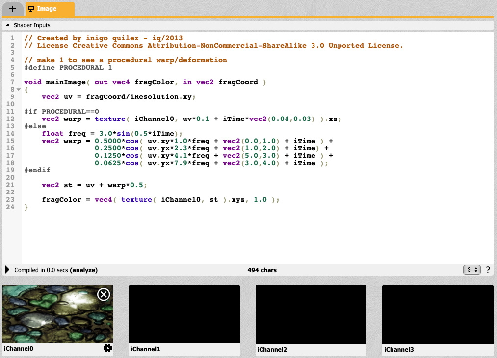

The main entrypoint of a shadertoy shader is a function called `mainImage` which receives 2 parameters as you can see in the screenshot above:

- `out vec4 fragColor` - assigning this variable will set the output color
- `in vec2 fragCoord` - this variable contains the x and y coordinate of the pixel

Start from the [basic image example](2d/02-image.html). We'll get this shader working in two big steps: first we set up the **inputs** the shader needs (the uniforms), then we translate the `mainImage` code itself.

### Setting up the shader inputs

A Shadertoy shader receives a bunch of extra inputs, which are not listed in the code. If you expand the Shader Inputs section, you'll see an overview of these inputs:

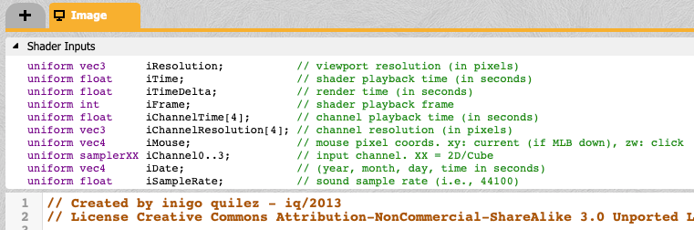

Look at the shadertoy code itself, and identify which inputs are actually being used. For this shader, that's `iResolution`, `iTime` and the `iChannel0` texture. Declare the first two in a Uniforms struct, and rename the `image` texture and `imageSampler` in your shader to `iChannel0` and `iSampler`, so the code can read the same as on Shadertoy:

```wgsl
struct Uniforms {
  iResolution: vec2f,
  iTime: f32,
};
@group(0) @binding(0) var<uniform> uniforms: Uniforms;
@group(0) @binding(1) var iSampler: sampler;
@group(0) @binding(2) var iChannel0: texture_2d<f32>;
```

Don't forget to update the `textureSample(...)` call in `fragmentMain` to the new names, otherwise the shader won't compile.

Next up: the `mainImage` function itself. WGSL has no `out` parameters, so our version of `mainImage` will *return* the color instead of assigning it to `fragColor`. Inside of `mainImage`, you can create local copies of the uniform values, so the code reads the same as on Shadertoy. For now, it just samples the texture:

```wgsl
fn mainImage(fragCoord: vec2f) -> vec4f {
  let iResolution = uniforms.iResolution;
  let iTime = uniforms.iTime;

  let uv = fragCoord / iResolution.xy;
  return textureSample(iChannel0, iSampler, uv); // temporary, until we translate the real code
}
```

Our fragment shader isn't calling this `mainImage` function yet. Change the `fragmentMain()` function, so it calls the `mainImage()` function. The pixel coordinate is available as `@builtin(position)`:

```wgsl
@fragment
fn fragmentMain(@builtin(position) fragCoord: vec4f) -> @location(0) vec4f {
  return mainImage(fragCoord.xy);
}
```

The shader now expects a uniform buffer at `@binding(0)`. Set it up in your javascript code, and add it to your bind group - we've used similar inputs in previous exercises 😁 There's one thing to watch out for in the offsets: a `vec2f` takes 2 floats, so `iTime` lives at offset 2:

```javascript
// the offsets (in floats) of each uniform value, must match the Uniforms struct in the shader
// a vec2f takes 2 floats, so iTime lives at offset 2
const uniforms = { iResolution: 0, iTime: 2 };
const uniformValues = new Float32Array(4);
// ...
```

Set the uniform values in the draw loop:

```javascript
const drawScene = (time = 0) => {
  setUniform('iResolution', canvas.width, canvas.height);
  setUniform('iTime', time / 1000);
  device.queue.writeBuffer(uniformBuffer, 0, uniformValues);
  // ...
```

Run the page: you should see the unchanged image. Nothing spectacular yet - but it's now rendered through `mainImage`, with working `iResolution`, `iTime` and `iChannel0` inputs. Time for the real translation.

### Translating the mainImage code

Now translate the shadertoy code to WGSL, step by step, replacing the temporary `textureSample` return in your `mainImage`. These are the translation rules you'll need:

1. Types: `vec2` → `vec2f`, `vec3` → `vec3f`, `vec4` → `vec4f`, `float` → `f32`.
2. Variables: `float freq = ...;` → `let freq = ...;`. If the variable gets modified afterwards (like `mask *= ...`), use `var` instead of `let`.
3. Functions: `void mainImage(out vec4 fragColor, in vec2 fragCoord)` → `fn mainImage(fragCoord: vec2f) -> vec4f`. WGSL has no `out` parameters: return the color instead of assigning it to `fragColor` (you already wrote this signature in the previous step).
4. `texture(iChannel0, uv)` → `textureSample(iChannel0, iSampler, uv)` - in WGSL the sampler is a separate parameter.
5. There is no preprocessor in WGSL: get rid of the `#define PROCEDURAL 1`, `#if`, `#else` and `#endif` lines and only keep the procedural branch.
6. Math functions such as `sin`, `cos`, `smoothstep` and `mix` exist in WGSL with the same name. Multiplying a vector with a number (`0.5000 * cos(...)`) works as well.

(A more complete overview of the differences is in the [WGSL cheat sheet](#wgsl-cheat-sheet-coming-from-glsl) at the bottom of this page.)

To see the rules in action, here's how the first lines of the Shadertoy code translate:

```glsl
// GLSL (Shadertoy)
void mainImage( out vec4 fragColor, in vec2 fragCoord )
{
    vec2 uv = fragCoord / iResolution.xy;

    float freq = 3.0*sin(0.5*iTime);
    ...
```

becomes:

```wgsl
// WGSL
fn mainImage(fragCoord: vec2f) -> vec4f {
  let uv = fragCoord / iResolution.xy;

  let freq = 3.0 * sin(0.5 * iTime);
  // ...
```

- Rule 3: the `out vec4 fragColor` parameter is gone. The function returns a `vec4f` instead, so at the bottom of the function, `fragColor = ...;` will become `return ...;`.
- Rules 1 & 2: `vec2 uv = ...` and `float freq = ...` become `let uv = ...` and `let freq = ...` (WGSL infers the types).
- Later in the shader, `mask` gets modified after its declaration (`mask *= ...`), so it needs to be a `var` instead of a `let`.

Note that the `uv` line is already in your skeleton from the previous step. Translate the rest of the shader the same way. You can [check out the solution](2d/11-shadertoy.html) when you're stuck.

### Fixing the final issues

You might expect an upside down image at this point: on Shadertoy (and in other GLSL environments), the pixel coordinate origin is at the *bottom-left*. In WebGPU, the pixel coordinate of `@builtin(position)` starts at the *top-left* of the canvas. As our texture coordinates start at the top-left as well, everything lines up and there's nothing to flip 🎉.

Don't like the stripe-repeats at the edges? You can implement the `smoothstep` masking approach from earlier!

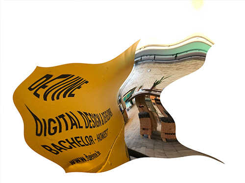

> ℹ️ Now that you've done a conversion by hand: an LLM (Claude, ChatGPT, Copilot, ...) can do a decent first-pass GLSL → WGSL conversion for you. Paste the result into your project and fix the remaining compile errors using the [WGSL cheat sheet](#wgsl-cheat-sheet-coming-from-glsl) - Chrome's WGSL error messages tell you exactly which line to look at. Do make sure you understand what the converted code does; you'll want to tweak it to make it your own.

# Vertex shaders

Up until now, our vertex shader has been pretty boring: 6 hardcoded positions, so the fragment shader could do all the work. In this chapter we'll do the opposite: send lots of vertices to the GPU and move them around in the vertex shader.

Open up [vertex/01-wave.html](vertex/01-wave.html). It draws a grid of 40 x 40 small squares, which wave up and down:

```wgsl
@vertex
fn vertexMain(@location(0) position: vec2f) -> VertexOutput {
  // move every vertex up or down, depending on its x position and the time
  let wave = sin(position.x * 6.0 + uniforms.time * 2.0) * 0.08;

  var output: VertexOutput;
  output.position = vec4f(position.x, position.y + wave, 0.0, 1.0);
  // the color is calculated per vertex as well, and interpolated over the triangle
  output.color = vec3f(0.5 + 0.5 * sin(uniforms.time + position.x * 3.0), 0.6, 1.0 - wave * 5.0);
  return output;
}
```

The vertex shader no longer uses `@builtin(vertex_index)` to look up a hardcoded position. Instead, it receives a `position` **attribute** at `@location(0)`: a value which is different for every vertex, read from a **vertex buffer**.

In the javascript, we build the grid in a `Float32Array` (2 triangles per square, 2 floats per vertex) and upload it to a buffer with the `VERTEX` usage:

```javascript
const vertexBuffer = device.createBuffer({
  size: vertexData.byteLength,
  usage: GPUBufferUsage.VERTEX | GPUBufferUsage.COPY_DST,
});
device.queue.writeBuffer(vertexBuffer, 0, vertexData);
```

The render pipeline needs to know how the data in that buffer is organised:

```javascript
vertex: {
  module: shaderModule,
  entryPoint: 'vertexMain',
  // describe how the data in our vertex buffer is organised
  buffers: [{
    arrayStride: 2 * 4, // 2 floats of 4 bytes per vertex
    attributes: [
      { shaderLocation: 0, offset: 0, format: 'float32x2' }, // @location(0) position: vec2f
    ],
  }],
},
```

And in the draw loop, we select the buffer and draw all vertices:

```javascript
pass.setVertexBuffer(0, vertexBuffer);
pass.draw(vertexCount);
```

Go through the rest of the code, it should look familiar by now. Some things to try:

- make the wave two-dimensional: use `sin(x) * cos(y)`
- displace the vertices horizontally as well
- pass the mouse position as a uniform, and use it as the origin of the wave
- move the vertices in a circle instead of up and down

# Compute shaders

Compute shaders are the big new feature of WebGPU: you can run any calculation on the GPU, in parallel, without drawing a single pixel. The classic example is a particle system: we let the GPU update thousands of particles every frame, and then draw them.

Open up [compute/01-particles.html](compute/01-particles.html). It simulates 20.000 particles which are attracted to your mouse cursor when hovering over the canvas, and end up swirling around it.

Read through the [Compute Shader Basics](https://webgpufundamentals.org/webgpu/lessons/webgpu-compute-shaders.html) on WebGPU Fundamentals first.

The particles live in a **storage buffer**: a buffer which (unlike a uniform buffer) can be huge, and can be written to from a shader:

```wgsl
struct Particle {
  position: vec2f,
  velocity: vec2f,
};

@group(0) @binding(1) var<storage, read_write> particles: array<Particle>;
```

The compute shader runs once for every particle. `@workgroup_size(64)` means the GPU processes the particles in groups of 64 and `global_invocation_id` tells us which particle we're processing:

```wgsl
@compute @workgroup_size(64)
fn simulate(@builtin(global_invocation_id) id: vec3u) {
  let i = id.x;
  // we launch a multiple of 64 invocations, so some might be out of range
  if (i >= arrayLength(&particles)) {
    return;
  }

  var p = particles[i];

  // per-particle randomness, calculated from the particle index (a classic shader "random" trick)
  // this gives the same value every frame for the same particle
  let random = fract(sin(f32(i) * 12.9898) * 43758.5453);
  let random2 = fract(sin(f32(i) * 78.233) * 43758.5453);

  let toMouse = uniforms.mouse - p.position;
  let dist = length(toMouse);
  let direction = toMouse / max(dist, 0.001);
  // a vector at 90 degrees to the direction of the mouse
  let tangent = vec2f(-direction.y, direction.x);
  // half of the particles rotate clockwise, the other half counter clockwise
  let spin = select(-1.0, 1.0, random > 0.5);

  // pull towards the mouse. The closer the particle gets, the weaker the pull, so it overshoots instead of stopping
  let pull = direction * smoothstep(0.0, 0.4, dist) * (2.0 + random2 * 2.0);
  // push sideways: this is what makes the particles rotate around the mouse
  let swirl = tangent * spin * (0.5 + random) * 2.0;

  p.velocity += (pull + swirl) * uniforms.attract * uniforms.deltaTime;
  // a little bit of drag
  p.velocity *= 0.995;

  // every particle has its own speed limit: faster particles end up in a bigger orbit
  let maxSpeed = 0.3 + random * 0.7;
  let speed = length(p.velocity);
  if (speed > maxSpeed) {
    p.velocity *= maxSpeed / speed;
  }

  p.position += p.velocity * uniforms.deltaTime;

  // bounce at the edges
  if (abs(p.position.x) > 1.0) {
    p.velocity.x = -p.velocity.x;
  }
  if (abs(p.position.y) > 1.0) {
    p.velocity.y = -p.velocity.y;
  }

  particles[i] = p;
}
```

A couple of things are going on in there:

- There is no `Math.random()` in a shader. The `fract(sin(i * 12.9898) * 43758.5453)` line is a well known trick to turn a number (here: the particle index) into a pseudo-random value between 0 and 1. It's the same value every frame for the same particle, so every particle gets its own personality.
- If we'd only pull the particles towards the mouse, they would all end up sitting on the cursor. By pushing them **sideways** as well (the `tangent` vector is the direction to the mouse, rotated by 90 degrees), they start rotating around it. Half of them spin one way, the other half the other way.
- The pull fades out when a particle gets close to the mouse (`smoothstep`), so particles overshoot instead of stopping.
- Every particle has its own speed limit. The faster a particle is allowed to go, the bigger its orbit becomes, so we get a swirling cloud instead of one thin ring.

To draw the particles, we reuse a trick from the 2d chapter: the vertex shader has 6 hardcoded corners of a small square. This time, we draw that square 20.000 times using **instancing**: `pass.draw(6, particleCount)`. The vertex shader receives an `@builtin(instance_index)`, which we use to look up the particle position in the same storage buffer:

```wgsl
let particle = particlesReadOnly[instanceIndex];
output.position = vec4f(particle.position + corners[vertexIndex] * size, 0.0, 1.0);
```

> A vertex shader is only allowed to *read* from storage buffers. That's why the shader declares the same buffer twice: once as `read_write` for the compute shader, and once as `read` for the vertex shader.

Both shaders run every frame, in the same command encoder: first a compute pass, then a render pass:

```javascript
const computePass = encoder.beginComputePass();
computePass.setPipeline(computePipeline);
computePass.setBindGroup(0, computeBindGroup);
computePass.dispatchWorkgroups(Math.ceil(particleCount / 64));
computePass.end();

const renderPass = encoder.beginRenderPass({ /* ... */ });
renderPass.setPipeline(renderPipeline);
renderPass.setBindGroup(0, renderBindGroup);
renderPass.draw(6, particleCount); // 6 vertices, drawn particleCount times
renderPass.end();
```

Some things to try:

- make all particles spin in the same direction (get rid of `spin`)
- play with the numbers: what happens with more drag, or a stronger sideways push?
- wrap the particles around the edges instead of bouncing
- make the size of a particle depend on its speed
- add a `time` uniform and cycle the colors
- push the particles away from the mouse instead of attracting them
- increase the particle count to 200.000. Still smooth? Try doing the same simulation in javascript 😉

# WGSL cheat sheet (coming from GLSL)

| GLSL | WGSL |
| --- | --- |
| `vec2`, `vec3`, `vec4` | `vec2f`, `vec3f`, `vec4f` |
| `float`, `int`, `uint` | `f32`, `i32`, `u32` |
| `mat4` | `mat4x4f` |
| `float x = 1.0;` | `let x = 1.0;` (constant) or `var x = 1.0;` (modifiable) |
| `vec3 f(vec3 c, float v) { ... }` | `fn f(c: vec3f, v: f32) -> vec3f { ... }` |
| `void main() { ... }` | `@vertex fn vertexMain(...) -> ...` / `@fragment fn fragmentMain(...) -> @location(0) vec4f` |
| `uniform float x;` | `struct Uniforms { x: f32 }; @group(0) @binding(0) var<uniform> uniforms: Uniforms;` |
| `uniform sampler2D image;` | `var image: texture_2d<f32>;` + `var imageSampler: sampler;` |
| `texture(image, uv)` | `textureSample(image, imageSampler, uv)` |
| `out vec2 uv;` (vertex) / `in vec2 uv;` (fragment) | `@location(0) uv: vec2f` in the output struct / function parameter |
| `gl_Position` | `@builtin(position)` in the output struct |
| `gl_FragCoord` | `@builtin(position)` parameter of the fragment shader (origin top-left!) |
| `outColor = color;` | `return color;` |
| `color.rgb *= 0.5;` | not allowed: `color = vec4f(color.rgb * 0.5, color.a);` |
| `color.r = 1.0;` | `color.r = 1.0;` (single components are fine, `color` must be a `var`) |
| `pos.s`, `pos.t` | `pos.x`, `pos.y` (only `xyzw` and `rgba` swizzles exist) |
| `if (x > 1.0) y = 0.0;` | `if (x > 1.0) { y = 0.0; }` (braces are required) |
| `#define`, `#if` | not available |
| `mix`, `step`, `smoothstep`, `length`, `dot`, `abs`, `max`, `sin`, `cos`, `clamp`, `fract`, `pow` | same names |

The full list of builtin functions is in the [WGSL function reference](https://webgpufundamentals.org/webgpu/lessons/webgpu-wgsl-function-reference.html).

More GLSL → WGSL references:

- [WebGPU from WebGL](https://webgpufundamentals.org/webgpu/lessons/webgpu-from-webgl.html) - side-by-side comparison of GLSL and WGSL shaders (and of both javascript APIs)
- [Tour of WGSL](https://google.github.io/tour-of-wgsl/) - an interactive tour of the WGSL language

# Where to go from here

- https://webgpufundamentals.org/ - the go-to resource for WebGPU, with lessons on everything we've touched (and more)
- https://google.github.io/tour-of-wgsl/ - an interactive tour of the WGSL language
- https://compute.toys/ - Shadertoy, but for WGSL compute shaders
- https://webgpu.github.io/webgpu-samples/ - official WebGPU samples
- https://www.w3.org/TR/webgpu/ & https://www.w3.org/TR/WGSL/ - the specifications
- https://threejs.org/docs/#api/en/renderers/WebGPURenderer - Three.js has a WebGPU renderer (with its own shader language, TSL) if you want to go 3D
- https://thebookofshaders.com/ - written for GLSL, but the concepts translate 1:1 to WGSL
